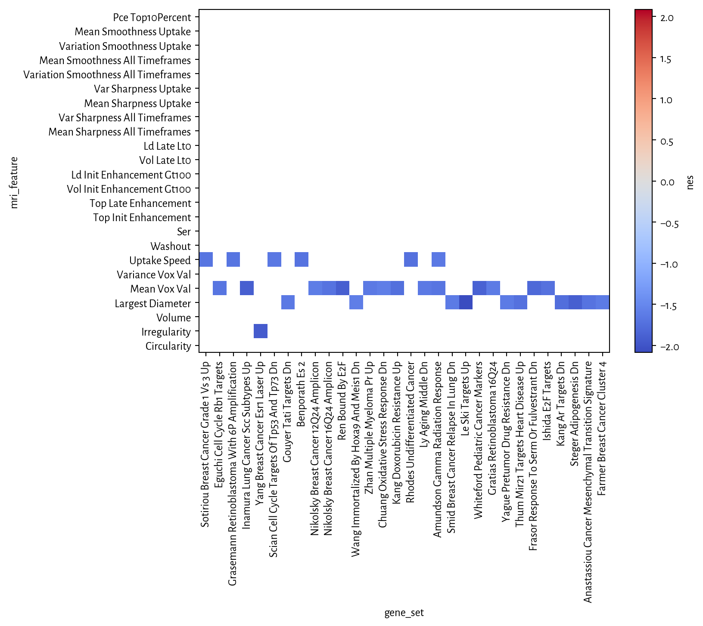

## Setup ## {.collapsed}

Load libraries.


```python
import sys

from IPython.display import display, Markdown
import numpy as np
import pandas as pd
from tabulate import tabulate
import xarray as xr

sys.path.append('../src/lib/')
import plot
```


Setup style of plots.


```python
import matplotlib
matplotlib.rcParams['font.family'] = 'sans-serif'
matplotlib.rcParams['font.sans-serif'] = ['Alegreya Sans']
matplotlib.rcParams['font.weight'] = 'regular'
```


A utility function to display tables with [DataTables](https://datatables.net).


```python
def display_table(t):
    display(Markdown(
        '<div class="datatable">' +
        tabulate(t, headers='keys') +
        "\n\n</div>"
    ))
```


Load gene set enrichment analysis (GSEA) results on the MsigDB Hallmarks set.


```python
def load_gsea_ds(fn):
    ds = xr.open_dataset(fn)
    ds['mri_feature'] = [s.decode() for s in ds['mri_feature'].values]
    ds['mri_feature'] = [" ".join(s.split('_')).title()
                         for s in ds['mri_feature'].values]
    ds['gene_set_code'] = ('gene_set',
                           [s.decode() for s in ds['gene_set'].values])
    ds['gene_set'] = [" ".join(s.split('_')).title()
                      for s in ds['gene_set_code'].values]
    return ds
df_h = load_gsea_ds("../analyses/gsea/h.all_T.nc")
df_cgp = load_gsea_ds("../analyses/gsea/c2.cgp_F.nc")
```


A function to plot a heatmap with normalized enrichment statistics (NES) that
are significant.


```python
def plot_ds(ds, fdr, le_prop=0.0):
    ds = ds.copy()
    ds['significance_mask'] = (ds['fdr'] > fdr) | (ds['le_prop'] < le_prop)
    ds = ds.sel(
        gene_set=np.logical_not(ds['significance_mask'])
                 .sum('mri_feature') > 0,
    )
    with plot.subplots(1, 1, figsize=(8, 5.5), dpi=192) as (fig, ax):
        plot.heatmap(ds['nes'], mask=ds['significance_mask'], ax=ax)
        ax.set_xticklabels(ax.get_xticklabels(), rotation=90)
```


A function to show significant pathway enrichments in a table.


```python
def table_ds(ds, fdr, le_prop=0.0):
    df = ds.to_dataframe()
    df.reset_index(level=0, inplace=True)
    display_table(df.loc[(df['fdr'] < fdr) & (df['le_prop'] > le_prop)])
```


## Results ##

Hallmarks from MSigDB.


```python
plot_ds(df_h, fdr=0.25)
```

{#hallmarks-es-plot }\


```python
table_ds(df_h, fdr=0.25)
```


<div class="datatable">mri_feature       gene_set                                          es           p      nes        fdr      fwer    max_es_at    le_prop  gene_set_code
----------------  ------------------------------------------  --------  ----------  -------  ---------  --------  -----------  ---------  ------------------------------------------
Mean Vox Val      Hallmark G2M Checkpoint                     0.62517   0.00369963  1.93383  0.0315265  0.184982         2280   0.583333  HALLMARK_G2M_CHECKPOINT
Uptake Speed      Hallmark G2M Checkpoint                     0.540112  0.0323      1.65809  0.117596   1                3215   0.583333  HALLMARK_G2M_CHECKPOINT
Mean Vox Val      Hallmark E2F Targets                        0.634263  0.0048      1.97713  0.0315265  0.24             2300   0.622222  HALLMARK_E2F_TARGETS
Uptake Speed      Hallmark E2F Targets                        0.533426  0.0481952   1.64931  0.117596   1                3912   0.655556  HALLMARK_E2F_TARGETS
Mean Vox Val      Hallmark Myc Targets V1                     0.477742  0.0183982   1.53602  0.167466   0.919908         3434   0.533679  HALLMARK_MYC_TARGETS_V1
Uptake Speed      Hallmark Myc Targets V1                     0.470222  0.0236976   1.50738  0.202166   1                3381   0.492228  HALLMARK_MYC_TARGETS_V1
Uptake Speed      Hallmark Myc Targets V2                     0.602285  0.00770925  1.76869  0.117596   0.385463         2878   0.618182  HALLMARK_MYC_TARGETS_V2
Circularity       Hallmark Epithelial Mesenchymal Transition  0.584357  0.0182982   1.85022  0.103377   0.914909         2313   0.52809   HALLMARK_EPITHELIAL_MESENCHYMAL_TRANSITION
Largest Diameter  Hallmark Epithelial Mesenchymal Transition  0.58873   0.0176982   1.8619   0.0983901  0.884912         2899   0.623596  HALLMARK_EPITHELIAL_MESENCHYMAL_TRANSITION
Mean Vox Val      Hallmark Spermatogenesis                    0.572799  0.0018      1.62621  0.133079   0.09             2490   0.491228  HALLMARK_SPERMATOGENESIS

</div>

Signatures of chemical and genetic perturbations from MSigDB.


```python
plot_ds(df_cgp, fdr=0.25, le_prop=0.8)
```

{#cgp-plot }\


```python
table_ds(df_cgp, fdr=0.25)
```


<div class="datatable">mri_feature                          gene_set                                                           es            p       nes         fdr      fwer    max_es_at    le_prop  gene_set_code
-----------------------------------  ----------------------------------------------------------  ---------  -----------  --------  ----------  --------  -----------  ---------  ----------------------------------------------------------
Mean Vox Val                         Nakamura Cancer Microenvironment Dn                         -0.724223  0.00364668   -1.82862  0.112782    1               10040   0.560976  NAKAMURA_CANCER_MICROENVIRONMENT_DN
Uptake Speed                         Nakamura Cancer Microenvironment Dn                         -0.711967  0.010349     -1.77325  0.205921    1                9527   0.609756  NAKAMURA_CANCER_MICROENVIRONMENT_DN
Uptake Speed                         West Adrenocortical Tumor Markers Up                        -0.751389  0.0205853    -1.7022   0.213722    1                9063   0.705882  WEST_ADRENOCORTICAL_TUMOR_MARKERS_UP
Largest Diameter                     West Adrenocortical Tumor Markers Dn                        -0.804335  0.00733981   -1.75719  0.129775    1               10472   0.6       WEST_ADRENOCORTICAL_TUMOR_MARKERS_DN
Uptake Speed                         Winter Hypoxia Up                                           -0.589122  0.00343573   -1.91023  0.205921    1                9270   0.45122   WINTER_HYPOXIA_UP
Mean Vox Val                         Pyeon Hpv Positive Tumors Up                                -0.569737  0.0467729    -1.63421  0.20147     1                8414   0.57971   PYEON_HPV_POSITIVE_TUMORS_UP
Largest Diameter                     Piccaluga Angioimmunoblastic Lymphoma Up                    -0.715744  0.000995223  -2.0675   0.0410123   1                9564   0.60733   PICCALUGA_ANGIOIMMUNOBLASTIC_LYMPHOMA_UP
Largest Diameter                     Lu Tumor Vasculature Up                                     -0.614022  0.0373494    -1.63847  0.214778    1                9856   0.5       LU_TUMOR_VASCULATURE_UP
Mean Vox Val                         Hollmann Apoptosis Via Cd40 Up                              -0.406631  0.0137124    -1.636    0.200842    1                7858   0.416667  HOLLMANN_APOPTOSIS_VIA_CD40_UP
Mean Vox Val                         Liu Sox4 Targets Dn                                         -0.373766  0.0108119    -1.62441  0.206164    1                8877   0.343972  LIU_SOX4_TARGETS_DN
Largest Diameter                     Bertucci Medullary Vs Ductal Breast Cancer Dn               -0.692817  0.00178501   -2.00623  0.0617073   1                9519   0.591549  BERTUCCI_MEDULLARY_VS_DUCTAL_BREAST_CANCER_DN
Largest Diameter                     Davicioni Pax Foxo1 Signature In Arms Dn                    -0.749328  0.00832507   -1.75029  0.129832    1                9558   0.714286  DAVICIONI_PAX_FOXO1_SIGNATURE_IN_ARMS_DN
Mean Vox Val                         Fournier Acinar Development Late Dn                         -0.732918  0.0274581    -1.67908  0.168901    1               10452   0.555556  FOURNIER_ACINAR_DEVELOPMENT_LATE_DN
Uptake Speed                         Fournier Acinar Development Late Dn                         -0.732817  0.0260799    -1.6673   0.223758    1                9654   0.611111  FOURNIER_ACINAR_DEVELOPMENT_LATE_DN
Mean Vox Val                         Sengupta Nasopharyngeal Carcinoma Up                        -0.50076   0.0282943    -1.6825   0.166914    1                8994   0.435484  SENGUPTA_NASOPHARYNGEAL_CARCINOMA_UP
Mean Vox Val                         Watanabe Colon Cancer Msi Vs Mss Up                         -0.529884  0.0150774    -1.66036  0.182957    1                9735   0.388889  WATANABE_COLON_CANCER_MSI_VS_MSS_UP
Mean Vox Val                         Sotiriou Breast Cancer Grade 1 Vs 3 Up                      -0.800669  0.0213494    -1.69942  0.159908    1               10063   0.762712  SOTIRIOU_BREAST_CANCER_GRADE_1_VS_3_UP
Uptake Speed                         Sotiriou Breast Cancer Grade 1 Vs 3 Up                      -0.802964  0.0189478    -1.68595  0.220126    1                9337   0.864407  SOTIRIOU_BREAST_CANCER_GRADE_1_VS_3_UP
Mean Vox Val                         Chemnitz Response To Prostaglandin E2 Up                    -0.567348  0.0618807    -1.65362  0.184156    1                9791   0.441667  CHEMNITZ_RESPONSE_TO_PROSTAGLANDIN_E2_UP
Uptake Speed                         Chemnitz Response To Prostaglandin E2 Up                    -0.595733  0.0366862    -1.72181  0.205921    1                9812   0.425     CHEMNITZ_RESPONSE_TO_PROSTAGLANDIN_E2_UP
Largest Diameter                     Davicioni Molecular Arms Vs Erms Dn                         -0.50191   0.0184817    -1.76012  0.127199    1                9004   0.5       DAVICIONI_MOLECULAR_ARMS_VS_ERMS_DN
Largest Diameter                     Davicioni Targets Of Pax Foxo1 Fusions Up                   -0.483935  0.0226512    -1.69901  0.158437    1                8960   0.509259  DAVICIONI_TARGETS_OF_PAX_FOXO1_FUSIONS_UP
Largest Diameter                     Davicioni Rhabdomyosarcoma Pax Foxo1 Fusion Dn              -0.728542  0.0277286    -1.63862  0.214778    1                9557   0.583333  DAVICIONI_RHABDOMYOSARCOMA_PAX_FOXO1_FUSION_DN
Largest Diameter                     Turashvili Breast Ductal Carcinoma Vs Ductal Normal Up      -0.623612  0.0213445    -1.77958  0.120187    1               10343   0.463415  TURASHVILI_BREAST_DUCTAL_CARCINOMA_VS_DUCTAL_NORMAL_UP
Largest Diameter                     Turashvili Breast Lobular Carcinoma Vs Ductal Normal Up     -0.696364  0.0391452    -1.74674  0.132214    1                9938   0.61194   TURASHVILI_BREAST_LOBULAR_CARCINOMA_VS_DUCTAL_NORMAL_UP
Variation Smoothness Uptake          Turashvili Breast Lobular Carcinoma Vs Ductal Normal Dn      0.653335  0.000809389   2.05318  0.142463    1                 856   0.407407  TURASHVILI_BREAST_LOBULAR_CARCINOMA_VS_DUCTAL_NORMAL_DN
Largest Diameter                     Turashvili Breast Lobular Carcinoma Vs Lobular Normal Dn    -0.686225  0.0185777    -1.86055  0.0870841   1               10289   0.507042  TURASHVILI_BREAST_LOBULAR_CARCINOMA_VS_LOBULAR_NORMAL_DN
Mean Vox Val                         Chandran Metastasis Top50 Up                                -0.566471  0.0073369    -1.79181  0.121023    1                8423   0.611111  CHANDRAN_METASTASIS_TOP50_UP
Mean Vox Val                         Wilcox Response To Progesterone Up                          -0.500879  0.0161852    -1.74179  0.138487    1                8799   0.440678  WILCOX_RESPONSE_TO_PROGESTERONE_UP
Largest Diameter                     Wilcox Response To Progesterone Dn                          -0.634754  0.0219124    -1.76187  0.127199    1                9557   0.613636  WILCOX_RESPONSE_TO_PROGESTERONE_DN
Largest Diameter                     Samols Targets Of Khsv Mirnas Dn                            -0.457275  0.0161983    -1.62946  0.215449    1                9838   0.346154  SAMOLS_TARGETS_OF_KHSV_MIRNAS_DN
Uptake Speed                         Pramoonjago Sox4 Targets Dn                                 -0.56613   0.00781877   -1.73593  0.205921    1                9011   0.428571  PRAMOONJAGO_SOX4_TARGETS_DN
Mean Vox Val                         Puiffe Invasion Inhibited By Ascites Up                     -0.450317  0.0219714    -1.63909  0.198089    1                9017   0.376812  PUIFFE_INVASION_INHIBITED_BY_ASCITES_UP
Uptake Speed                         Puiffe Invasion Inhibited By Ascites Up                     -0.465154  0.0138203    -1.68121  0.223061    1                9538   0.347826  PUIFFE_INVASION_INHIBITED_BY_ASCITES_UP
Largest Diameter                     Corre Multiple Myeloma Up                                   -0.538013  0.0349556    -1.62565  0.215449    1                8621   0.581395  CORRE_MULTIPLE_MYELOMA_UP
Largest Diameter                     Corre Multiple Myeloma Dn                                   -0.537894  0.0194098    -1.73679  0.135776    1                9448   0.5       CORRE_MULTIPLE_MYELOMA_DN
Largest Diameter                     Charafe Breast Cancer Basal Vs Mesenchymal Dn               -0.722927  0.00274564   -1.89387  0.0721102   1                9877   0.594595  CHARAFE_BREAST_CANCER_BASAL_VS_MESENCHYMAL_DN
Mean Vox Val                         Borczuk Malignant Mesothelioma Up                           -0.485061  0.0287857    -1.69322  0.162256    1                8342   0.464407  BORCZUK_MALIGNANT_MESOTHELIOMA_UP
Largest Diameter                     Roy Wound Blood Vessel Up                                   -0.691231  0.00869565   -1.85193  0.0870841   1                9142   0.733333  ROY_WOUND_BLOOD_VESSEL_UP
Largest Diameter                     Newman Ercc6 Targets Dn                                     -0.661359  0.0532697    -1.60362  0.225682    1                9778   0.56      NEWMAN_ERCC6_TARGETS_DN
Mean Vox Val                         Horiuchi Wtap Targets Dn                                    -0.568771  0.00661455   -1.87527  0.089681    1                9315   0.458015  HORIUCHI_WTAP_TARGETS_DN
Uptake Speed                         Horiuchi Wtap Targets Dn                                    -0.53906   0.0209466    -1.76862  0.205921    1                8868   0.465649  HORIUCHI_WTAP_TARGETS_DN
Mean Vox Val                         Basaki Ybx1 Targets Up                                      -0.610139  0.00242718   -1.94218  0.0786993   1                9699   0.467249  BASAKI_YBX1_TARGETS_UP
Uptake Speed                         Basaki Ybx1 Targets Up                                      -0.570144  0.0146282    -1.79404  0.205921    1                8908   0.484716  BASAKI_YBX1_TARGETS_UP
Largest Diameter                     Vecchi Gastric Cancer Advanced Vs Early Up                  -0.713599  0.00934765   -1.8995   0.0721102   1                9661   0.619048  VECCHI_GASTRIC_CANCER_ADVANCED_VS_EARLY_UP
Mean Vox Val                         Slebos Head And Neck Cancer With Hpv Up                     -0.616379  0.0228106    -1.71242  0.156994    1                8680   0.6       SLEBOS_HEAD_AND_NECK_CANCER_WITH_HPV_UP
Mean Vox Val                         Jaeger Metastasis Up                                        -0.56659   0.0361178    -1.64226  0.194651    1                9355   0.5       JAEGER_METASTASIS_UP
Uptake Speed                         Jaeger Metastasis Up                                        -0.598466  0.0182951    -1.72842  0.205921    1                9762   0.382353  JAEGER_METASTASIS_UP
Mean Vox Val                         Ginestier Breast Cancer 20Q13 Amplification Dn              -0.560087  0.0156125    -1.77553  0.124212    1                7501   0.625806  GINESTIER_BREAST_CANCER_20Q13_AMPLIFICATION_DN
Uptake Speed                         Gargalovic Response To Oxidized Phospholipids Turquoise Dn  -0.621253  0.0509464    -1.61358  0.24828     1                8939   0.615385  GARGALOVIC_RESPONSE_TO_OXIDIZED_PHOSPHOLIPIDS_TURQUOISE_DN
Uptake Speed                         Gargalovic Response To Oxidized Phospholipids Red Up        -0.68776   0.0105949    -1.72987  0.205921    1                9966   0.5       GARGALOVIC_RESPONSE_TO_OXIDIZED_PHOSPHOLIPIDS_RED_UP
Largest Diameter                     Takeda Targets Of Nup98 Hoxa9 Fusion 8D Up                  -0.483085  0.0476951    -1.6181   0.217968    1                8289   0.622449  TAKEDA_TARGETS_OF_NUP98_HOXA9_FUSION_8D_UP
Uptake Speed                         Lopez Mesotelioma Survival Time Up                          -0.809703  0.0128773    -1.65808  0.227789    1               10361   0.583333  LOPEZ_MESOTELIOMA_SURVIVAL_TIME_UP
Uptake Speed                         Tonks Targets Of Runx1 Runx1T1 Fusion Monocyte Up           -0.427929  0.0147356    -1.64733  0.227789    1                8698   0.405714  TONKS_TARGETS_OF_RUNX1_RUNX1T1_FUSION_MONOCYTE_UP
Largest Diameter                     Tonks Targets Of Runx1 Runx1T1 Fusion Erythrocyte Up        -0.459262  0.029406     -1.63751  0.214778    1                9106   0.455285  TONKS_TARGETS_OF_RUNX1_RUNX1T1_FUSION_ERYTHROCYTE_UP
Largest Diameter                     Papaspyridonos Unstable Aterosclerotic Plaque Dn            -0.695147  0.00615324   -1.85751  0.0870841   1                9105   0.657895  PAPASPYRIDONOS_UNSTABLE_ATEROSCLEROTIC_PLAQUE_DN
Mean Vox Val                         Dittmer Pthlh Targets Up                                    -0.38234   0.015009     -1.57909  0.244298    1                7698   0.453704  DITTMER_PTHLH_TARGETS_UP
Mean Vox Val                         Udayakumar Med1 Targets Up                                  -0.453787  0.00226291   -1.77768  0.124212    1                7976   0.471545  UDAYAKUMAR_MED1_TARGETS_UP
Mean Vox Val                         Odonnell Tfrc Targets Dn                                    -0.697719  0.0117743    -1.89755  0.0835299   1               10040   0.590909  ODONNELL_TFRC_TARGETS_DN
Uptake Speed                         Odonnell Tfrc Targets Dn                                    -0.636759  0.0448575    -1.72346  0.205921    1               10036   0.465909  ODONNELL_TFRC_TARGETS_DN
Mean Vox Val                         Odonnell Targets Of Myc And Tfrc Dn                         -0.781534  0.0167914    -1.74388  0.138487    1                9755   0.735294  ODONNELL_TARGETS_OF_MYC_AND_TFRC_DN
Uptake Speed                         Odonnell Targets Of Myc And Tfrc Dn                         -0.7617    0.0255734    -1.67689  0.223061    1               10131   0.588235  ODONNELL_TARGETS_OF_MYC_AND_TFRC_DN
Largest Diameter                     Senese Hdac1 Targets Dn                                     -0.487616  0.00598205   -1.80898  0.10556     1                9114   0.463542  SENESE_HDAC1_TARGETS_DN
Largest Diameter                     Senese Hdac1 And Hdac2 Targets Dn                           -0.542774  0.00360144   -1.90043  0.0721102   1                9070   0.51497   SENESE_HDAC1_AND_HDAC2_TARGETS_DN
Largest Diameter                     Senese Hdac2 Targets Dn                                     -0.598392  0.00317334   -1.91545  0.0721102   1                9578   0.52439   SENESE_HDAC2_TARGETS_DN
Largest Diameter                     Lee Neural Crest Stem Cell Up                               -0.607014  0.00482897   -1.89701  0.0721102   1                9550   0.521277  LEE_NEURAL_CREST_STEM_CELL_UP
Largest Diameter                     Kinsey Targets Of Ewsr1 Flii Fusion Dn                      -0.509097  0.00832507   -1.81335  0.105504    1                9378   0.418182  KINSEY_TARGETS_OF_EWSR1_FLII_FUSION_DN
Mean Vox Val                         Scibetta Kdm5B Targets Dn                                   -0.45496   0.0324609    -1.59246  0.235213    1               10343   0.269841  SCIBETTA_KDM5B_TARGETS_DN
Largest Diameter                     Elvidge Hif1A And Hif2A Targets Dn                          -0.480334  0.0548267    -1.57586  0.243702    1                8729   0.488636  ELVIDGE_HIF1A_AND_HIF2A_TARGETS_DN
Largest Diameter                     Morosetti Facioscapulohumeral Muscular Distrophy Up         -0.796087  0.00784314   -1.75042  0.129832    1               10196   0.666667  MOROSETTI_FACIOSCAPULOHUMERAL_MUSCULAR_DISTROPHY_UP
Mean Vox Val                         Graham Cml Quiescent Vs Normal Quiescent Up                 -0.617424  0.0042796    -1.89061  0.087042    1               10344   0.369231  GRAHAM_CML_QUIESCENT_VS_NORMAL_QUIESCENT_UP
Uptake Speed                         Graham Cml Quiescent Vs Normal Quiescent Up                 -0.562421  0.0294775    -1.71489  0.205921    1                9803   0.4       GRAHAM_CML_QUIESCENT_VS_NORMAL_QUIESCENT_UP
Mean Vox Val                         Graham Cml Dividing Vs Normal Quiescent Up                  -0.703391  0.00284322   -1.94267  0.0786993   1                9730   0.592593  GRAHAM_CML_DIVIDING_VS_NORMAL_QUIESCENT_UP
Uptake Speed                         Graham Cml Dividing Vs Normal Quiescent Up                  -0.643014  0.0278342    -1.75749  0.205921    1                9555   0.555556  GRAHAM_CML_DIVIDING_VS_NORMAL_QUIESCENT_UP
Mean Vox Val                         Graham Normal Quiescent Vs Normal Dividing Dn               -0.775835  0.0192191    -1.74043  0.138487    1                9743   0.769231  GRAHAM_NORMAL_QUIESCENT_VS_NORMAL_DIVIDING_DN
Uptake Speed                         Graham Normal Quiescent Vs Normal Dividing Dn               -0.776148  0.0171787    -1.72601  0.205921    1                9708   0.723077  GRAHAM_NORMAL_QUIESCENT_VS_NORMAL_DIVIDING_DN
Mean Vox Val                         Bidus Metastasis Up                                         -0.63461   0.00285074   -1.908    0.0828711   1                9323   0.549223  BIDUS_METASTASIS_UP
Uptake Speed                         Bidus Metastasis Up                                         -0.600445  0.0113568    -1.80099  0.205921    1                9320   0.466321  BIDUS_METASTASIS_UP
Mean Vox Val                         Hahtola Sezary Syndrom Up                                   -0.448727  0.0253088    -1.59903  0.22739     1                9236   0.310811  HAHTOLA_SEZARY_SYNDROM_UP
Mean Vox Val                         Provenzani Metastasis Up                                    -0.443322  0.0104881    -1.74858  0.137118    1                9356   0.347561  PROVENZANI_METASTASIS_UP
Largest Diameter                     Provenzani Metastasis Dn                                    -0.430635  0.0197355    -1.61894  0.217968    1                9703   0.330579  PROVENZANI_METASTASIS_DN
Largest Diameter                     Liu Cdx2 Targets Up                                         -0.642339  0.0112381    -1.68666  0.16674     1                8509   0.722222  LIU_CDX2_TARGETS_UP
Mean Vox Val                         Chow Rassf1 Targets Up                                      -0.569861  0.0117976    -1.70977  0.157451    1                8877   0.461538  CHOW_RASSF1_TARGETS_UP
Largest Diameter                     Landis Breast Cancer Progression Dn                         -0.651576  0.00237718   -1.97683  0.0617073   1               10263   0.459016  LANDIS_BREAST_CANCER_PROGRESSION_DN
Mean Vox Val                         Lau Apoptosis Cdkn2A Up                                     -0.440604  0.0164779    -1.59804  0.228075    1                8111   0.431373  LAU_APOPTOSIS_CDKN2A_UP
Largest Diameter                     Chiaradonna Neoplastic Transformation Kras Cdc25 Dn         -0.703305  0.00298211   -1.89213  0.0721102   1                9515   0.560976  CHIARADONNA_NEOPLASTIC_TRANSFORMATION_KRAS_CDC25_DN
Mean Vox Val                         Chiaradonna Neoplastic Transformation Kras Up               -0.522917  0.00243952   -1.82772  0.112782    1                8149   0.560748  CHIARADONNA_NEOPLASTIC_TRANSFORMATION_KRAS_UP
Largest Diameter                     Chiaradonna Neoplastic Transformation Kras Dn               -0.549062  0.00098561   -1.94764  0.0721102   1                9014   0.528455  CHIARADONNA_NEOPLASTIC_TRANSFORMATION_KRAS_DN
Largest Diameter                     Chiaradonna Neoplastic Transformation Cdc25 Up              -0.447288  0.0308396    -1.60303  0.225682    1                9515   0.419048  CHIARADONNA_NEOPLASTIC_TRANSFORMATION_CDC25_UP
Largest Diameter                     Chiaradonna Neoplastic Transformation Cdc25 Dn              -0.416693  0.0242242    -1.60548  0.224122    1                8694   0.468254  CHIARADONNA_NEOPLASTIC_TRANSFORMATION_CDC25_DN
Largest Diameter                     Castellano Nras Targets Dn                                  -0.684127  0.0346       -1.60771  0.222476    1                8776   0.75      CASTELLANO_NRAS_TARGETS_DN
Largest Diameter                     Chebotaev Gr Targets Dn                                     -0.571833  0.0144183    -1.77246  0.12126     1                9363   0.478873  CHEBOTAEV_GR_TARGETS_DN
Largest Diameter                     Berenjeno Transformed By Rhoa Reversibly Dn                 -0.639154  0.019318     -1.71913  0.143503    1                8864   0.62963   BERENJENO_TRANSFORMED_BY_RHOA_REVERSIBLY_DN
Mean Vox Val                         Lindgren Bladder Cancer Cluster 3 Up                        -0.578644  0.0208248    -1.77014  0.124212    1                9318   0.464029  LINDGREN_BLADDER_CANCER_CLUSTER_3_UP
Uptake Speed                         Lindgren Bladder Cancer Cluster 3 Up                        -0.617469  0.00522613   -1.87953  0.205921    1                9276   0.532374  LINDGREN_BLADDER_CANCER_CLUSTER_3_UP
Mean Vox Val                         Naderi Breast Cancer Prognosis Up                           -0.741117  0.0257816    -1.66993  0.176303    1                9514   0.71875   NADERI_BREAST_CANCER_PROGNOSIS_UP
Uptake Speed                         Naderi Breast Cancer Prognosis Up                           -0.728272  0.0364934    -1.63651  0.23199     1                9686   0.625     NADERI_BREAST_CANCER_PROGNOSIS_UP
Largest Diameter                     Naderi Breast Cancer Prognosis Dn                           -0.656456  0.0308812    -1.62948  0.215449    1                9550   0.5625    NADERI_BREAST_CANCER_PROGNOSIS_DN
Mean Vox Val                         Markey Rb1 Chronic Lof Up                                   -0.523394  0.00102249   -1.90324  0.0828711   1                9374   0.380435  MARKEY_RB1_CHRONIC_LOF_UP
Mean Vox Val                         Markey Rb1 Acute Lof Up                                     -0.585653  0.0136013    -1.82926  0.112782    1                9318   0.505102  MARKEY_RB1_ACUTE_LOF_UP
Uptake Speed                         Markey Rb1 Acute Lof Up                                     -0.557542  0.0331658    -1.72937  0.205921    1                9093   0.489796  MARKEY_RB1_ACUTE_LOF_UP
Mean Vox Val                         Chin Breast Cancer Copy Number Up                           -0.564892  0.0434433    -1.57802  0.245127    1                8868   0.5       CHIN_BREAST_CANCER_COPY_NUMBER_UP
Mean Vox Val                         Chin Breast Cancer Copy Number Dn                           -0.609877  0.0415826    -1.57228  0.248313    1               10489   0.333333  CHIN_BREAST_CANCER_COPY_NUMBER_DN
Uptake Speed                         Vanharanta Uterine Fibroid With 7Q Deletion Up              -0.487156  0.0138999    -1.66566  0.223758    1                8080   0.516129  VANHARANTA_UTERINE_FIBROID_WITH_7Q_DELETION_UP
Mean Vox Val                         Landis Erbb2 Breast Tumors 65 Up                            -0.538836  0.0326931    -1.59976  0.227133    1                9887   0.3       LANDIS_ERBB2_BREAST_TUMORS_65_UP
Largest Diameter                     Landis Erbb2 Breast Tumors 65 Dn                            -0.533776  0.0328882    -1.64507  0.209912    1                9896   0.424242  LANDIS_ERBB2_BREAST_TUMORS_65_DN
Largest Diameter                     Gaussmann Mll Af4 Fusion Targets E Up                       -0.512306  0.0307935    -1.66199  0.18828     1               10080   0.356164  GAUSSMANN_MLL_AF4_FUSION_TARGETS_E_UP
Largest Diameter                     Gaussmann Mll Af4 Fusion Targets F Up                       -0.513578  0.0117976    -1.77978  0.120187    1                9544   0.403974  GAUSSMANN_MLL_AF4_FUSION_TARGETS_F_UP
Largest Diameter                     Berenjeno Transformed By Rhoa Forever Up                    -0.703507  0.0112871    -1.7312   0.135776    1               10256   0.466667  BERENJENO_TRANSFORMED_BY_RHOA_FOREVER_UP
Mean Vox Val                         Cairo Pml Targets Bound By Myc Up                           -0.627402  0.00949111   -1.74096  0.138487    1                9191   0.5       CAIRO_PML_TARGETS_BOUND_BY_MYC_UP
Uptake Speed                         Ouellet Ovarian Cancer Invasive Vs Lmp Up                   -0.628661  0.00300661   -1.87321  0.205921    1                9167   0.54955   OUELLET_OVARIAN_CANCER_INVASIVE_VS_LMP_UP
Largest Diameter                     Landis Erbb2 Breast Tumors 324 Dn                           -0.497893  0.00676213   -1.83268  0.0934065   1                9753   0.358779  LANDIS_ERBB2_BREAST_TUMORS_324_DN
Mean Vox Val                         Missiaglia Regulated By Methylation Dn                      -0.696602  0.00425187   -1.86875  0.091339    1                9725   0.641509  MISSIAGLIA_REGULATED_BY_METHYLATION_DN
Uptake Speed                         Missiaglia Regulated By Methylation Dn                      -0.6216    0.05001      -1.65287  0.227789    1                9170   0.537736  MISSIAGLIA_REGULATED_BY_METHYLATION_DN
Mean Vox Val                         Tang Senescence Tp53 Targets Dn                             -0.76703   0.0248585    -1.75985  0.132473    1               10132   0.666667  TANG_SENESCENCE_TP53_TARGETS_DN
Uptake Speed                         Tang Senescence Tp53 Targets Dn                             -0.731106  0.0496152    -1.66588  0.223758    1               10428   0.555556  TANG_SENESCENCE_TP53_TARGETS_DN
Largest Diameter                     Wang Barretts Esophagus Up                                  -0.513519  0.0282587    -1.62707  0.215449    1                9253   0.472222  WANG_BARRETTS_ESOPHAGUS_UP
Largest Diameter                     Wang Esophagus Cancer Vs Normal Up                          -0.494304  0.0335769    -1.64753  0.207483    1                9559   0.382353  WANG_ESOPHAGUS_CANCER_VS_NORMAL_UP
Mean Vox Val                         Roylance Breast Cancer 16Q Copy Number Up                   -0.650421  0.0697062    -1.61675  0.213062    1                8979   0.611111  ROYLANCE_BREAST_CANCER_16Q_COPY_NUMBER_UP
Mean Vox Val                         Johansson Gliomagenesis By Pdgfb Up                         -0.493218  0.0332259    -1.60013  0.227133    1                8835   0.381818  JOHANSSON_GLIOMAGENESIS_BY_PDGFB_UP
Uptake Speed                         Vetter Targets Of Prkca And Ets1 Dn                         -0.642797  0.0278746    -1.61309  0.24828     1                9314   0.5       VETTER_TARGETS_OF_PRKCA_AND_ETS1_DN
Largest Diameter                     Dunne Targets Of Aml1 Mtg8 Fusion Dn                        -0.663949  0.0324931    -1.62877  0.215449    1               10071   0.5625    DUNNE_TARGETS_OF_AML1_MTG8_FUSION_DN
Largest Diameter                     Mcbryan Pubertal Tgfb1 Targets Up                           -0.483783  0.0157048    -1.73542  0.135776    1                9381   0.432099  MCBRYAN_PUBERTAL_TGFB1_TARGETS_UP
Largest Diameter                     Hummerich Malignant Skin Tumor Up                           -0.698315  0.0335466    -1.58169  0.238858    1                9007   0.615385  HUMMERICH_MALIGNANT_SKIN_TUMOR_UP
Largest Diameter                     Zirn Tretinoin Response Up                                  -0.599864  0.0389687    -1.59631  0.227088    1               10356   0.388889  ZIRN_TRETINOIN_RESPONSE_UP
Mean Vox Val                         Nunoda Response To Dasatinib Imatinib Up                    -0.548386  0.0161903    -1.66818  0.176303    1               10192   0.272727  NUNODA_RESPONSE_TO_DASATINIB_IMATINIB_UP
Largest Diameter                     Mahadevan Imatinib Resistance Up                            -0.791175  0.00297324   -1.85762  0.0870841   1                9828   0.733333  MAHADEVAN_IMATINIB_RESISTANCE_UP
Largest Diameter                     Mahadevan Imatinib Resistance Dn                            -0.678959  0.0276397    -1.62     0.217968    1               10453   0.416667  MAHADEVAN_IMATINIB_RESISTANCE_DN
Mean Vox Val                         Tomida Metastasis Up                                        -0.642685  0.0258169    -1.67124  0.176303    1                8283   0.65      TOMIDA_METASTASIS_UP
Uptake Speed                         Tomida Metastasis Up                                        -0.661077  0.0130943    -1.71295  0.205921    1                9264   0.6       TOMIDA_METASTASIS_UP
Largest Diameter                     Hwang Prostate Cancer Markers                               -0.493327  0.0203517    -1.61878  0.217968    1                8695   0.52      HWANG_PROSTATE_CANCER_MARKERS
Largest Diameter                     Begum Targets Of Pax3 Foxo1 Fusion Up                       -0.543905  0.0422841    -1.62528  0.215449    1                8734   0.553191  BEGUM_TARGETS_OF_PAX3_FOXO1_FUSION_UP
Largest Diameter                     Begum Targets Of Pax3 Foxo1 Fusion Dn                       -0.637092  0.00969721   -1.81017  0.105504    1                9041   0.594595  BEGUM_TARGETS_OF_PAX3_FOXO1_FUSION_DN
Mean Vox Val                         Olsson E2F3 Targets Dn                                      -0.589716  0.0340012    -1.6643   0.180015    1               10071   0.4       OLSSON_E2F3_TARGETS_DN
Uptake Speed                         Olsson E2F3 Targets Dn                                      -0.653851  0.00467195   -1.85124  0.205921    1                9684   0.457143  OLSSON_E2F3_TARGETS_DN
Uptake Speed                         Marks Hdac Targets Dn                                       -0.632316  0.0170992    -1.65159  0.227789    1               10998   0.363636  MARKS_HDAC_TARGETS_DN
Mean Vox Val                         Choi Atl Stage Predictor                                    -0.50002   0.0133006    -1.67946  0.168901    1                7948   0.525     CHOI_ATL_STAGE_PREDICTOR
Largest Diameter                     Wong Endmetrium Cancer Dn                                   -0.759947  0.0167331    -1.77431  0.12126     1                9681   0.734694  WONG_ENDMETRIUM_CANCER_DN
Mean Vox Val                         Kong E2F3 Targets                                           -0.83345   0.00201735   -1.88114  0.0891627   1                9943   0.791667  KONG_E2F3_TARGETS
Uptake Speed                         Kong E2F3 Targets                                           -0.73347   0.0539778    -1.63373  0.233655    1                9093   0.763889  KONG_E2F3_TARGETS
Mean Vox Val                         Tanaka Methylated In Esophageal Carcinoma                   -0.471776  0.00876656   -1.69319  0.162256    1                7908   0.46      TANAKA_METHYLATED_IN_ESOPHAGEAL_CARCINOMA
Mean Vox Val                         Eguchi Cell Cycle Rb1 Targets                               -0.914447  0.00243704   -1.68798  0.164021    1               10488   0.95      EGUCHI_CELL_CYCLE_RB1_TARGETS
Mean Vox Val                         Riz Erythroid Differentiation                               -0.601061  0.00141729   -1.97457  0.0786993   1                8851   0.52381   RIZ_ERYTHROID_DIFFERENTIATION
Uptake Speed                         Riz Erythroid Differentiation                               -0.548195  0.00903433   -1.79068  0.205921    1                9037   0.460317  RIZ_ERYTHROID_DIFFERENTIATION
Mean Vox Val                         Riz Erythroid Differentiation Ccne1                         -0.492232  0.0109091    -1.65562  0.184156    1                8851   0.4       RIZ_ERYTHROID_DIFFERENTIATION_CCNE1
Mean Vox Val                         Riz Erythroid Differentiation Hbz                           -0.515913  0.0206645    -1.64307  0.194651    1               10363   0.32      RIZ_ERYTHROID_DIFFERENTIATION_HBZ
Mean Vox Val                         Wakasugi Have Znf143 Binding Sites                          -0.514064  0.0304026    -1.6103   0.216582    1                7614   0.666667  WAKASUGI_HAVE_ZNF143_BINDING_SITES
Uptake Speed                         Dacosta Uv Response Via Ercc3 Ttd Up                        -0.509255  0.0179775    -1.65315  0.227789    1                9910   0.272727  DACOSTA_UV_RESPONSE_VIA_ERCC3_TTD_UP
Largest Diameter                     Mahadevan Gist Morphological Switch                         -0.759238  0.0190438    -1.70809  0.151158    1                9485   0.714286  MAHADEVAN_GIST_MORPHOLOGICAL_SWITCH
Mean Vox Val                         Roversi Glioma Copy Number Dn                               -0.513397  0.0146134    -1.69096  0.162256    1                8979   0.411765  ROVERSI_GLIOMA_COPY_NUMBER_DN
Largest Diameter                     Hummerich Skin Cancer Progression Dn                        -0.421707  0.0364846    -1.57999  0.238871    1                9621   0.3625    HUMMERICH_SKIN_CANCER_PROGRESSION_DN
Uptake Speed                         Rashi Response To Ionizing Radiation 1                      -0.530266  0.029442     -1.65935  0.227637    1               10662   0.212121  RASHI_RESPONSE_TO_IONIZING_RADIATION_1
Mean Vox Val                         Iwanaga E2F1 Targets Induced By Serum                       -0.806014  0.000205002  -2.17179  0.0305194   0.54551         10025   0.625     IWANAGA_E2F1_TARGETS_INDUCED_BY_SERUM
Largest Diameter                     Lindgren Bladder Cancer High Recurrence                     -0.703547  0.00535927   -1.90226  0.0721102   1               10225   0.522727  LINDGREN_BLADDER_CANCER_HIGH_RECURRENCE
Largest Diameter                     Ebauer Myogenic Targets Of Pax3 Foxo1 Fusion                -0.564986  0.040412     -1.6179   0.217968    1                9631   0.555556  EBAUER_MYOGENIC_TARGETS_OF_PAX3_FOXO1_FUSION
Mean Vox Val                         Mattioli Mgus Vs Pcl                                        -0.562069  0.00966573   -1.79317  0.120886    1                8968   0.483871  MATTIOLI_MGUS_VS_PCL
Mean Vox Val                         Grasemann Retinoblastoma With 6P Amplification              -0.773635  0.00803859   -1.73928  0.138487    1                9998   0.583333  GRASEMANN_RETINOBLASTOMA_WITH_6P_AMPLIFICATION
Uptake Speed                         Grasemann Retinoblastoma With 6P Amplification              -0.755086  0.0114943    -1.68179  0.223061    1               10210   0.833333  GRASEMANN_RETINOBLASTOMA_WITH_6P_AMPLIFICATION
Uptake Speed                         Schlosser Myc And Serum Response Synergy                    -0.579581  0.0404204    -1.61733  0.24828     1                8938   0.571429  SCHLOSSER_MYC_AND_SERUM_RESPONSE_SYNERGY
Mean Vox Val                         Schlosser Myc Targets Repressed By Serum                    -0.532036  0.027049     -1.70601  0.157451    1                8118   0.543624  SCHLOSSER_MYC_TARGETS_REPRESSED_BY_SERUM
Uptake Speed                         Schlosser Myc Targets Repressed By Serum                    -0.535654  0.0236       -1.71366  0.205921    1                9120   0.483221  SCHLOSSER_MYC_TARGETS_REPRESSED_BY_SERUM
Mean Vox Val                         Schlosser Myc Targets And Serum Response Dn                 -0.636857  0.0333534    -1.69097  0.162256    1                8673   0.590909  SCHLOSSER_MYC_TARGETS_AND_SERUM_RESPONSE_DN
Uptake Speed                         Schlosser Myc Targets And Serum Response Dn                 -0.71332   0.0020141    -1.88214  0.205921    1                9069   0.727273  SCHLOSSER_MYC_TARGETS_AND_SERUM_RESPONSE_DN
Mean Vox Val                         Schlosser Myc Targets And Serum Response Up                 -0.558973  0.0472677    -1.62031  0.209301    1                8005   0.636364  SCHLOSSER_MYC_TARGETS_AND_SERUM_RESPONSE_UP
Uptake Speed                         Schlosser Myc Targets And Serum Response Up                 -0.587497  0.0204984    -1.69492  0.216543    1                7862   0.727273  SCHLOSSER_MYC_TARGETS_AND_SERUM_RESPONSE_UP
Mean Vox Val                         Rosty Cervical Cancer Proliferation Cluster                 -0.833722  0.00546448   -1.80734  0.112782    1                9975   0.782609  ROSTY_CERVICAL_CANCER_PROLIFERATION_CLUSTER
Uptake Speed                         Rosty Cervical Cancer Proliferation Cluster                 -0.766617  0.0433989    -1.64076  0.23199     1                9545   0.730435  ROSTY_CERVICAL_CANCER_PROLIFERATION_CLUSTER
Largest Diameter                     La Men1 Targets                                             -0.63012   0.0125171    -1.7228   0.143499    1                9766   0.473684  LA_MEN1_TARGETS
Mean Vox Val                         Honrado Breast Cancer Brca1 Vs Brca2                        -0.714701  0.00145409   -1.93129  0.0786993   1                9269   0.529412  HONRADO_BREAST_CANCER_BRCA1_VS_BRCA2
Largest Diameter                     Xu Hgf Targets Induced By Akt1 48Hr Up                      -0.790532  0.012304     -1.67728  0.175132    1                9444   0.7       XU_HGF_TARGETS_INDUCED_BY_AKT1_48HR_UP
Mean Vox Val                         Xu Hgf Targets Induced By Akt1 48Hr Dn                      -0.68531   0.00404531   -1.80099  0.118413    1                8900   0.666667  XU_HGF_TARGETS_INDUCED_BY_AKT1_48HR_DN
Largest Diameter                     Shi Sparc Targets Dn                                        -0.608481  0.0300963    -1.61144  0.219427    1                9185   0.5       SHI_SPARC_TARGETS_DN
Mean Vox Val                         Neben Aml With Flt3 Or Nras Dn                              -0.689541  0.0273477    -1.61473  0.215345    1               10063   0.454545  NEBEN_AML_WITH_FLT3_OR_NRAS_DN
Mean Smoothness All Timeframes       Heidenblad Amplified In Pancreatic Cancer                   -0.725185  0.000393159  -2.12827  0.054112    1                9657   0.642857  HEIDENBLAD_AMPLIFIED_IN_PANCREATIC_CANCER
Largest Diameter                     Teramoto Opn Targets Cluster 6                              -0.519103  0.0364437    -1.58408  0.238858    1                8864   0.521739  TERAMOTO_OPN_TARGETS_CLUSTER_6
Mean Vox Val                         Teramoto Opn Targets Cluster 7                              -0.601206  0.0225624    -1.65341  0.184156    1                8413   0.533333  TERAMOTO_OPN_TARGETS_CLUSTER_7
Largest Diameter                     Kang Gist With Pdgfra Up                                    -0.629969  0.00777512   -1.79648  0.114579    1                8585   0.615385  KANG_GIST_WITH_PDGFRA_UP
Mean Vox Val                         Meinhold Ovarian Cancer Low Grade Dn                        -0.630691  0.0432049    -1.58362  0.238648    1                8089   0.684211  MEINHOLD_OVARIAN_CANCER_LOW_GRADE_DN
Largest Diameter                     Dacosta Ercc3 Allele Xpcs Vs Ttd Up                         -0.573235  0.0363206    -1.59003  0.234633    1                8517   0.722222  DACOSTA_ERCC3_ALLELE_XPCS_VS_TTD_UP
Largest Diameter                     Weinmann Adaptation To Hypoxia Up                           -0.623179  0.0159844    -1.73049  0.135776    1                9536   0.478261  WEINMANN_ADAPTATION_TO_HYPOXIA_UP
Largest Diameter                     Weinmann Adaptation To Hypoxia Dn                           -0.609536  0.0227139    -1.68744  0.166669    1                9373   0.516129  WEINMANN_ADAPTATION_TO_HYPOXIA_DN
Largest Diameter                     Tsunoda Cisplatin Resistance Up                             -0.665537  0.0462185    -1.60173  0.225682    1                9538   0.642857  TSUNODA_CISPLATIN_RESISTANCE_UP
Largest Diameter                     Tsunoda Cisplatin Resistance Dn                             -0.481496  0.0301217    -1.58176  0.238858    1                9826   0.372093  TSUNODA_CISPLATIN_RESISTANCE_DN
Mean Vox Val                         Li Wilms Tumor Anaplastic Up                                -0.773561  0.0373813    -1.6242   0.206164    1               10398   0.666667  LI_WILMS_TUMOR_ANAPLASTIC_UP
Mean Vox Val                         Mann Response To Amifostine Dn                              -0.732162  0.0254545    -1.63288  0.20147     1               10356   0.5       MANN_RESPONSE_TO_AMIFOSTINE_DN
Mean Vox Val                         Oxford Rala Or Ralb Targets Up                              -0.76633   0.00784077   -1.81588  0.112782    1                9269   0.72093   OXFORD_RALA_OR_RALB_TARGETS_UP
Uptake Speed                         Oxford Rala Or Ralb Targets Up                              -0.721458  0.0293585    -1.66997  0.223758    1                9578   0.674419  OXFORD_RALA_OR_RALB_TARGETS_UP
Largest Diameter                     Oxford Rala Or Ralb Targets Dn                              -0.624977  0.00315333   -1.89249  0.0721102   1                9274   0.565217  OXFORD_RALA_OR_RALB_TARGETS_DN
Largest Diameter                     Mohankumar Tlx1 Targets Dn                                  -0.488598  0.0189861    -1.68398  0.168699    1                9401   0.394958  MOHANKUMAR_TLX1_TARGETS_DN
Largest Diameter                     Murata Virulence Of H Pilori                                -0.681279  0.0136601    -1.7144   0.146766    1                9556   0.722222  MURATA_VIRULENCE_OF_H_PILORI
Mean Vox Val                         Li Wilms Tumor Vs Fetal Kidney 2 Up                         -0.575396  0.0213537    -1.66902  0.176303    1               10121   0.47619   LI_WILMS_TUMOR_VS_FETAL_KIDNEY_2_UP
Largest Diameter                     Li Wilms Tumor Vs Fetal Kidney 2 Dn                         -0.536179  0.0552904    -1.59084  0.234261    1                9096   0.534884  LI_WILMS_TUMOR_VS_FETAL_KIDNEY_2_DN
Largest Diameter                     Simbulan Uv Response Normal Dn                              -0.514805  0.0405379    -1.57189  0.24651     1                9303   0.586207  SIMBULAN_UV_RESPONSE_NORMAL_DN
Uptake Speed                         Ceballos Targets Of Tp53 And Myc Up                         -0.529901  0.0216606    -1.63725  0.23199     1               10156   0.315789  CEBALLOS_TARGETS_OF_TP53_AND_MYC_UP
Mean Vox Val                         Inamura Lung Cancer Scc Subtypes Up                         -0.790399  0.00101958   -1.89787  0.0835299   1                9201   0.846154  INAMURA_LUNG_CANCER_SCC_SUBTYPES_UP
Largest Diameter                     Wattel Autonomous Thyroid Adenoma Dn                        -0.531611  0.0484956    -1.5882   0.234815    1                9256   0.5       WATTEL_AUTONOMOUS_THYROID_ADENOMA_DN
Largest Diameter                     Sasai Resistance To Neoplastic Transfromation               -0.717799  0.00333857   -1.91049  0.0721102   1                9751   0.638298  SASAI_RESISTANCE_TO_NEOPLASTIC_TRANSFROMATION
Uptake Speed                         Kim Myc Amplification Targets Up                            -0.433243  0.0102124    -1.70047  0.214628    1                8474   0.490446  KIM_MYC_AMPLIFICATION_TARGETS_UP
Irregularity                         Yang Breast Cancer Esr1 Laser Up                            -0.802864  0.0001998    -1.93094  0.218098    0.531668         9060   0.933333  YANG_BREAST_CANCER_ESR1_LASER_UP
Largest Diameter                     Howlin Pubertal Mammary Gland                               -0.51332   0.0624383    -1.56989  0.246995    1                9650   0.38      HOWLIN_PUBERTAL_MAMMARY_GLAND
Mean Vox Val                         Furukawa Dusp6 Targets Pci35 Dn                             -0.735052  0.00384304   -1.94277  0.0786993   1                9813   0.588235  FURUKAWA_DUSP6_TARGETS_PCI35_DN
Uptake Speed                         Furukawa Dusp6 Targets Pci35 Dn                             -0.661227  0.032427     -1.73252  0.205921    1                9864   0.529412  FURUKAWA_DUSP6_TARGETS_PCI35_DN
Largest Diameter                     Lien Breast Carcinoma Metaplastic                           -0.809621  0.00517928   -1.84756  0.0888087   1               10327   0.733333  LIEN_BREAST_CARCINOMA_METAPLASTIC
Largest Diameter                     Tomlins Prostate Cancer Dn                                  -0.627403  0.0562313    -1.62162  0.217968    1                9557   0.648649  TOMLINS_PROSTATE_CANCER_DN
Mean Vox Val                         Liang Hematopoiesis Stem Cell Number Large Vs Tiny Dn       -0.483356  0.0180381    -1.60923  0.216653    1                8213   0.555556  LIANG_HEMATOPOIESIS_STEM_CELL_NUMBER_LARGE_VS_TINY_DN
Mean Vox Val                         Pujana Breast Cancer Lit Int Network                        -0.568659  0.00307945   -1.87745  0.089681    1                8503   0.516484  PUJANA_BREAST_CANCER_LIT_INT_NETWORK
Mean Vox Val                         Pujana Xprss Int Network                                    -0.69009   0.00362538   -1.92458  0.0786993   1                9064   0.673203  PUJANA_XPRSS_INT_NETWORK
Mean Vox Val                         Pujana Brca Centered Network                                -0.709327  0.00222627   -1.90924  0.0828711   1                9327   0.660714  PUJANA_BRCA_CENTERED_NETWORK
Uptake Speed                         Pujana Brca Centered Network                                -0.611912  0.0563324    -1.64022  0.23199     1                9183   0.553571  PUJANA_BRCA_CENTERED_NETWORK
Largest Diameter                     Schlesinger Methylated De Novo In Cancer                    -0.515276  0.035749     -1.58819  0.234815    1                8675   0.534884  SCHLESINGER_METHYLATED_DE_NOVO_IN_CANCER
Largest Diameter                     Khetchoumian Trim24 Targets Up                              -0.637448  0.0198965    -1.74894  0.130459    1                8996   0.568182  KHETCHOUMIAN_TRIM24_TARGETS_UP
Largest Diameter                     Cowling Mycn Targets                                        -0.729614  0.00392696   -1.87183  0.0798342   1                9114   0.730769  COWLING_MYCN_TARGETS
Mean Vox Val                         Kauffmann Melanoma Relapse Up                               -0.751443  0.00344828   -1.83257  0.112782    1                9975   0.608696  KAUFFMANN_MELANOMA_RELAPSE_UP
Uptake Speed                         Gross Hif1A Targets Dn                                      -0.70801   0.0128101    -1.76604  0.205921    1                9503   0.578947  GROSS_HIF1A_TARGETS_DN
Largest Diameter                     Ingram Shh Targets Dn                                       -0.479002  0.0400476    -1.57208  0.24651     1                9828   0.375     INGRAM_SHH_TARGETS_DN
Largest Diameter                     Mantovani Nfkb Targets Up                                   -0.572333  0.0164159    -1.69746  0.159612    1                9854   0.4375    MANTOVANI_NFKB_TARGETS_UP
Largest Diameter                     Mantovani Viral Gpcr Signaling Up                           -0.511331  0.00467745   -1.76652  0.123761    1                9714   0.389831  MANTOVANI_VIRAL_GPCR_SIGNALING_UP
Mean Vox Val                         Ferreira Ewings Sarcoma Unstable Vs Stable Up               -0.650487  0.00242375   -1.95679  0.0786993   1                9640   0.511628  FERREIRA_EWINGS_SARCOMA_UNSTABLE_VS_STABLE_UP
Uptake Speed                         Ferreira Ewings Sarcoma Unstable Vs Stable Up               -0.562316  0.0497883    -1.66926  0.223758    1                9260   0.472868  FERREIRA_EWINGS_SARCOMA_UNSTABLE_VS_STABLE_UP
Largest Diameter                     Liao Have Sox4 Binding Sites                                -0.536649  0.00783447   -1.74562  0.132581    1                8887   0.5625    LIAO_HAVE_SOX4_BINDING_SITES
Mean Vox Val                         Scian Cell Cycle Targets Of Tp53 And Tp73 Dn                -0.828087  0.00967547   -1.70281  0.157451    1               10296   0.736842  SCIAN_CELL_CYCLE_TARGETS_OF_TP53_AND_TP73_DN
Uptake Speed                         Scian Cell Cycle Targets Of Tp53 And Tp73 Dn                -0.803403  0.0175894    -1.64973  0.227789    1                9577   0.842105  SCIAN_CELL_CYCLE_TARGETS_OF_TP53_AND_TP73_DN
Largest Diameter                     Guenther Growth Spherical Vs Adherent Dn                    -0.581296  0.0461078    -1.59848  0.225689    1                9390   0.52      GUENTHER_GROWTH_SPHERICAL_VS_ADHERENT_DN
Largest Diameter                     Gouyer Tati Targets Dn                                      -0.724917  0.0297702    -1.63643  0.214778    1                8585   0.818182  GOUYER_TATI_TARGETS_DN
Mean Vox Val                         Caffarel Response To Thc Dn                                 -0.648352  0.0352467    -1.64663  0.19233     1                9167   0.666667  CAFFAREL_RESPONSE_TO_THC_DN
Uptake Speed                         Caffarel Response To Thc 24Hr 5 Up                          -0.676366  0.000199681  -2.01519  0.205921    0.53135          8879   0.6       CAFFAREL_RESPONSE_TO_THC_24HR_5_UP
Largest Diameter                     Bertucci Invasive Carcinoma Ductal Vs Lobular Dn            -0.692067  0.0471698    -1.63527  0.214778    1                9911   0.571429  BERTUCCI_INVASIVE_CARCINOMA_DUCTAL_VS_LOBULAR_DN
Mean Vox Val                         Garcia Targets Of Fli1 And Dax1 Dn                          -0.537236  0.017283     -1.74133  0.138487    1                8472   0.568     GARCIA_TARGETS_OF_FLI1_AND_DAX1_DN
Largest Diameter                     Rickman Tumor Differentiated Moderately Vs Poorly Up        -0.380619  0.0273399    -1.57091  0.246995    1                9941   0.277778  RICKMAN_TUMOR_DIFFERENTIATED_MODERATELY_VS_POORLY_UP
Largest Diameter                     Schaeffer Prostate Development 12Hr Dn                      -0.605214  0.0171076    -1.75386  0.129832    1                9882   0.483871  SCHAEFFER_PROSTATE_DEVELOPMENT_12HR_DN
Largest Diameter                     Schaeffer Prostate Development 48Hr Dn                      -0.457418  0.0346192    -1.64463  0.209912    1                9126   0.436364  SCHAEFFER_PROSTATE_DEVELOPMENT_48HR_DN
Largest Diameter                     Rickman Head And Neck Cancer B                              -0.737707  0.00330161   -1.89055  0.0721102   1               10107   0.5       RICKMAN_HEAD_AND_NECK_CANCER_B
Largest Diameter                     Wu Cell Migration                                           -0.496999  0.0225269    -1.70735  0.151158    1                8848   0.551282  WU_CELL_MIGRATION
Largest Diameter                     Colin Pilocytic Astrocytoma Vs Glioblastoma Up              -0.673029  0.00197472   -1.89903  0.0721102   1                9237   0.652174  COLIN_PILOCYTIC_ASTROCYTOMA_VS_GLIOBLASTOMA_UP
Largest Diameter                     Gotzmann Epithelial To Mesenchymal Transition Up            -0.52326   0.0382266    -1.62697  0.215449    1               10097   0.42623   GOTZMANN_EPITHELIAL_TO_MESENCHYMAL_TRANSITION_UP
Mean Vox Val                         Den Interact With Lca5                                      -0.667655  0.00806452   -1.77387  0.124212    1                8921   0.6       DEN_INTERACT_WITH_LCA5
Mean Vox Val                         Benporath Es 1                                              -0.540631  0.00748685   -1.84842  0.102501    1                9053   0.470588  BENPORATH_ES_1
Uptake Speed                         Benporath Es 2                                              -0.733649  0.00799672   -1.71031  0.205921    1                8807   0.8       BENPORATH_ES_2
Mean Vox Val                         Benporath Myc Targets With Ebox                             -0.400501  0.0193922    -1.611    0.216582    1                8241   0.428571  BENPORATH_MYC_TARGETS_WITH_EBOX
Mean Vox Val                         Benporath Proliferation                                     -0.714095  0.0178715    -1.74675  0.137118    1                8968   0.688525  BENPORATH_PROLIFERATION
Uptake Speed                         Benporath Proliferation                                     -0.710966  0.0202265    -1.7302   0.205921    1                9415   0.688525  BENPORATH_PROLIFERATION
Largest Diameter                     Petretto Cardiac Hypertrophy                                -0.677712  0.0110935    -1.83923  0.0919542   1                9329   0.727273  PETRETTO_CARDIAC_HYPERTROPHY
Mean Vox Val                         Benporath Es Core Nine Correlated                           -0.617689  0.0500303    -1.6199   0.209301    1                8012   0.705882  BENPORATH_ES_CORE_NINE_CORRELATED
Uptake Speed                         Benporath Es Core Nine Correlated                           -0.705393  0.00383451   -1.85838  0.205921    1                8797   0.682353  BENPORATH_ES_CORE_NINE_CORRELATED
Largest Diameter                     Amit Egf Response 480 Hela                                  -0.449113  0.0220429    -1.66274  0.18828     1                9196   0.438356  AMIT_EGF_RESPONSE_480_HELA
Mean Vox Val                         Georges Cell Cycle Mir192 Targets                           -0.584973  0.00650274   -1.80908  0.112782    1                9014   0.537037  GEORGES_CELL_CYCLE_MIR192_TARGETS
Largest Diameter                     Jeon Smad6 Targets Up                                       -0.711004  0.0135907    -1.73141  0.135776    1               10210   0.45      JEON_SMAD6_TARGETS_UP
Largest Diameter                     Sung Metastasis Stroma Up                                   -0.536576  0.00460553   -1.84004  0.0919542   1                9206   0.47      SUNG_METASTASIS_STROMA_UP
Mean Vox Val                         Sung Metastasis Stroma Dn                                   -0.645076  0.00201735   -1.90218  0.0828711   1                8420   0.674419  SUNG_METASTASIS_STROMA_DN
Uptake Speed                         Sung Metastasis Stroma Dn                                   -0.620242  0.0088194    -1.83361  0.205921    1                9425   0.465116  SUNG_METASTASIS_STROMA_DN
Mean Vox Val                         Mori Pre Bi Lymphocyte Up                                   -0.691208  0.0118952    -1.82329  0.112782    1                9801   0.590909  MORI_PRE_BI_LYMPHOCYTE_UP
Uptake Speed                         Mori Pre Bi Lymphocyte Up                                   -0.632005  0.0523046    -1.66113  0.227637    1                9545   0.515152  MORI_PRE_BI_LYMPHOCYTE_UP
Mean Vox Val                         Mori Large Pre Bii Lymphocyte Up                            -0.736224  0.00907258   -1.80836  0.112782    1                9093   0.75641   MORI_LARGE_PRE_BII_LYMPHOCYTE_UP
Uptake Speed                         Mori Large Pre Bii Lymphocyte Up                            -0.687484  0.0372009    -1.6775   0.223061    1                9342   0.576923  MORI_LARGE_PRE_BII_LYMPHOCYTE_UP
Mean Vox Val                         Mori Small Pre Bii Lymphocyte Dn                            -0.459714  0.0114389    -1.66094  0.182957    1                8933   0.411765  MORI_SMALL_PRE_BII_LYMPHOCYTE_DN
Mean Vox Val                         Mori Immature B Lymphocyte Dn                               -0.729232  0.0128308    -1.80728  0.112782    1                9058   0.74026   MORI_IMMATURE_B_LYMPHOCYTE_DN
Uptake Speed                         Mori Immature B Lymphocyte Dn                               -0.717336  0.0180361    -1.76453  0.205921    1                9538   0.61039   MORI_IMMATURE_B_LYMPHOCYTE_DN
Uptake Speed                         Mori Mature B Lymphocyte Dn                                 -0.591512  0.010241     -1.78891  0.205921    1                9093   0.540984  MORI_MATURE_B_LYMPHOCYTE_DN
Mean Vox Val                         Mori Emu Myc Lymphoma By Onset Time Up                      -0.490089  0.0315406    -1.64306  0.194651    1                8041   0.520833  MORI_EMU_MYC_LYMPHOMA_BY_ONSET_TIME_UP
Mean Vox Val                         Collis Prkdc Substrates                                     -0.580859  0.0346269    -1.61215  0.216582    1                8959   0.444444  COLLIS_PRKDC_SUBSTRATES
Mean Vox Val                         Collis Prkdc Regulators                                     -0.578477  0.0412926    -1.57346  0.248133    1                9194   0.428571  COLLIS_PRKDC_REGULATORS
Mean Vox Val                         Kauffmann Dna Repair Genes                                  -0.486848  0.0112108    -1.75034  0.137118    1                8638   0.438503  KAUFFMANN_DNA_REPAIR_GENES
Mean Vox Val                         Kauffmann Dna Replication Genes                             -0.631303  0.00060778   -2.06246  0.0786993   1                8490   0.622951  KAUFFMANN_DNA_REPLICATION_GENES
Uptake Speed                         Kauffmann Dna Replication Genes                             -0.518345  0.0303757    -1.69089  0.216543    1                9060   0.467213  KAUFFMANN_DNA_REPLICATION_GENES
Mean Vox Val                         Nikolsky Breast Cancer 8P12 P11 Amplicon                    -0.647677  0.0746535    -1.59072  0.235267    1                7986   0.763158  NIKOLSKY_BREAST_CANCER_8P12_P11_AMPLICON
Mean Vox Val                         Nikolsky Breast Cancer 11Q12 Q14 Amplicon                   -0.54427   0.0410195    -1.7168   0.155217    1                7997   0.554455  NIKOLSKY_BREAST_CANCER_11Q12_Q14_AMPLICON
Largest Diameter                     Nikolsky Breast Cancer 12Q13 Q21 Amplicon                    0.806542  0.00362319    2.0552   0.213562    1                 654   0.677419  NIKOLSKY_BREAST_CANCER_12Q13_Q21_AMPLICON
Mean Vox Val                         Nikolsky Breast Cancer 12Q24 Amplicon                       -0.810167  0.0229249    -1.61206  0.216582    1                9999   0.818182  NIKOLSKY_BREAST_CANCER_12Q24_AMPLICON
Mean Vox Val                         Nikolsky Breast Cancer 16Q24 Amplicon                       -0.747861  0.0259267    -1.70417  0.157451    1                9115   0.8125    NIKOLSKY_BREAST_CANCER_16Q24_AMPLICON
Largest Diameter                     Ji Metastasis Repressed By Stk11                            -0.665892  0.00514241   -1.8265   0.0940357   1                9515   0.590909  JI_METASTASIS_REPRESSED_BY_STK11
Largest Diameter                     Onder Cdh1 Targets 2 Up                                     -0.664326  0.00179497   -2.01623  0.0617073   1                9277   0.614286  ONDER_CDH1_TARGETS_2_UP
Mean Vox Val                         Onder Cdh1 Targets 1 Dn                                     -0.456507  0.00995733   -1.68699  0.164021    1                8676   0.425373  ONDER_CDH1_TARGETS_1_DN
Largest Diameter                     Onder Cdh1 Targets 3 Up                                     -0.672128  0.00916883   -1.77062  0.12126     1                8990   0.6       ONDER_CDH1_TARGETS_3_UP
Largest Diameter                     Onder Cdh1 Signaling Via Ctnnb1                             -0.625178  0.00826772   -1.88907  0.0721102   1                9743   0.52      ONDER_CDH1_SIGNALING_VIA_CTNNB1
Largest Diameter                     Cervera Sdhb Targets 2                                      -0.456683  0.0330448    -1.60005  0.225682    1                9360   0.43038   CERVERA_SDHB_TARGETS_2
Largest Diameter                     Rozanov Mmp14 Targets Subset                                -0.796947  0.00690335   -1.82246  0.0970559   1                9800   0.75      ROZANOV_MMP14_TARGETS_SUBSET
Largest Diameter                     Rozanov Mmp14 Targets Up                                    -0.420036  0.0362       -1.59915  0.225682    1                9472   0.352941  ROZANOV_MMP14_TARGETS_UP
Largest Diameter                     Cervera Sdhb Targets 1 Up                                   -0.538603  0.00990884   -1.77349  0.12126     1                9054   0.493151  CERVERA_SDHB_TARGETS_1_UP
Mean Vox Val                         Kenny Ctnnb1 Targets Up                                     -0.495746  0.00322191   -1.762    0.130875    1                8984   0.382979  KENNY_CTNNB1_TARGETS_UP
Uptake Speed                         Tarte Plasma Cell Vs B Lymphocyte Up                        -0.520121  0.0372646    -1.66624  0.223758    1                9290   0.432836  TARTE_PLASMA_CELL_VS_B_LYMPHOCYTE_UP
Uptake Speed                         Sweet Kras Targets Dn                                       -0.483211  0.0113383    -1.67282  0.223758    1                9188   0.47619   SWEET_KRAS_TARGETS_DN
Largest Diameter                     Ross Aml With Pml Rara Fusion                               -0.457964  0.0121104    -1.65592  0.195428    1                9035   0.375     ROSS_AML_WITH_PML_RARA_FUSION
Mean Vox Val                         Park Hsc Vs Multipotent Progenitors Dn                      -0.624246  0.0207295    -1.65599  0.184156    1                9327   0.571429  PARK_HSC_VS_MULTIPOTENT_PROGENITORS_DN
Mean Vox Val                         Basso B Lymphocyte Network                                  -0.491282  0.0218006    -1.68197  0.166914    1                8417   0.429688  BASSO_B_LYMPHOCYTE_NETWORK
Uptake Speed                         Basso B Lymphocyte Network                                  -0.488528  0.0217654    -1.67151  0.223758    1                9352   0.4375    BASSO_B_LYMPHOCYTE_NETWORK
Largest Diameter                     Lei Hoxc8 Targets Dn                                        -0.757434  0.015949     -1.72452  0.142379    1               10383   0.538462  LEI_HOXC8_TARGETS_DN
Uptake Speed                         Iizuka Liver Cancer Progression L1 G1 Dn                    -0.645803  0.0250903    -1.64927  0.227789    1                9623   0.454545  IIZUKA_LIVER_CANCER_PROGRESSION_L1_G1_DN
Uptake Speed                         Iizuka Liver Cancer Progression G1 G2 Dn                    -0.635057  0.00817384   -1.79911  0.205921    1                9039   0.44      IIZUKA_LIVER_CANCER_PROGRESSION_G1_G2_DN
Uptake Speed                         Lamb Ccnd1 Targets                                          -0.560259  0.0287916    -1.61402  0.24828     1               10471   0.352941  LAMB_CCND1_TARGETS
Mean Vox Val                         Shepard Bmyb Morpholino Dn                                  -0.524016  0.00928355   -1.8426   0.107881    1                9968   0.363636  SHEPARD_BMYB_MORPHOLINO_DN
Mean Vox Val                         Smith Tert Targets Up                                       -0.460367  0.00121976   -1.81942  0.112782    1                9236   0.385827  SMITH_TERT_TARGETS_UP
Uptake Speed                         Smith Tert Targets Up                                       -0.449155  0.00301326   -1.764    0.205921    1                9024   0.425197  SMITH_TERT_TARGETS_UP
Uptake Speed                         Menssen Myc Targets                                         -0.654277  0.00580581   -1.80766  0.205921    1                8698   0.686275  MENSSEN_MYC_TARGETS
Largest Diameter                     Jechlinger Epithelial To Mesenchymal Transition Up          -0.70414   0.00557991   -1.8808   0.0757285   1                9654   0.589286  JECHLINGER_EPITHELIAL_TO_MESENCHYMAL_TRANSITION_UP
Mean Vox Val                         Flechner Pbl Kidney Transplant Ok Vs Donor Dn               -0.569645  0.00100766   -1.91517  0.0828711   1                8424   0.526316  FLECHNER_PBL_KIDNEY_TRANSPLANT_OK_VS_DONOR_DN
Mean Vox Val                         Shepard Bmyb Targets                                        -0.720626  0.00468623   -1.92813  0.0786993   1               10414   0.5       SHEPARD_BMYB_TARGETS
Uptake Speed                         Shepard Bmyb Targets                                        -0.657044  0.0296086    -1.75182  0.205921    1               10368   0.478261  SHEPARD_BMYB_TARGETS
Mean Vox Val                         Kannan Tp53 Targets Dn                                      -0.561097  0.0216563    -1.61977  0.209301    1                9182   0.411765  KANNAN_TP53_TARGETS_DN
Largest Diameter                     Chang Pou5F1 Targets Up                                     -0.633185  0.0486454    -1.59799  0.225689    1               10288   0.5       CHANG_POU5F1_TARGETS_UP
Largest Diameter                     Sana Tnf Signaling Dn                                       -0.50295   0.031454     -1.67587  0.176062    1                9277   0.481013  SANA_TNF_SIGNALING_DN
Mean Vox Val                         Peng Leucine Deprivation Dn                                 -0.572826  0.0158183    -1.78     0.124212    1                8643   0.505682  PENG_LEUCINE_DEPRIVATION_DN
Uptake Speed                         Peng Leucine Deprivation Dn                                 -0.568337  0.016465     -1.76407  0.205921    1                8576   0.551136  PENG_LEUCINE_DEPRIVATION_DN
Mean Vox Val                         Shepard Crush And Burn Mutant Dn                            -0.59164   0.00142248   -1.96075  0.0786993   1               10314   0.382609  SHEPARD_CRUSH_AND_BURN_MUTANT_DN
Uptake Speed                         Shepard Crush And Burn Mutant Dn                            -0.493687  0.0518593    -1.62918  0.236787    1                9087   0.443478  SHEPARD_CRUSH_AND_BURN_MUTANT_DN
Mean Vox Val                         Manalo Hypoxia Dn                                           -0.604493  0.0294177    -1.74992  0.137118    1                9009   0.528926  MANALO_HYPOXIA_DN
Uptake Speed                         Manalo Hypoxia Dn                                           -0.621925  0.02         -1.77456  0.205921    1                9177   0.557851  MANALO_HYPOXIA_DN
Mean Vox Val                         Bystroem Correlated With Il5 Up                             -0.486661  0.008478     -1.69768  0.160274    1                9827   0.282051  BYSTROEM_CORRELATED_WITH_IL5_UP
Mean Vox Val                         Vantveer Breast Cancer Metastasis Dn                        -0.682148  0.014257     -1.77083  0.124212    1                9327   0.621053  VANTVEER_BREAST_CANCER_METASTASIS_DN
Uptake Speed                         Vantveer Breast Cancer Metastasis Dn                        -0.66424   0.0253241    -1.71217  0.205921    1                8583   0.673684  VANTVEER_BREAST_CANCER_METASTASIS_DN
Mean Vox Val                         Tarte Plasma Cell Vs Plasmablast Dn                         -0.536739  0.0331715    -1.69067  0.162256    1                8938   0.451957  TARTE_PLASMA_CELL_VS_PLASMABLAST_DN
Uptake Speed                         Tarte Plasma Cell Vs Plasmablast Dn                         -0.561789  0.0160804    -1.7674   0.205921    1                9503   0.466192  TARTE_PLASMA_CELL_VS_PLASMABLAST_DN
Mean Vox Val                         Le Egr2 Targets Up                                          -0.729922  0.000403959  -2.03848  0.0786993   1                9263   0.653061  LE_EGR2_TARGETS_UP
Uptake Speed                         Le Egr2 Targets Up                                          -0.625316  0.034266     -1.73038  0.205921    1                9545   0.520408  LE_EGR2_TARGETS_UP
Mean Vox Val                         Fernandez Bound By Myc                                      -0.392729  0.0121951    -1.60279  0.224092    1                8892   0.35      FERNANDEZ_BOUND_BY_MYC
Mean Vox Val                         Flechner Pbl Kidney Transplant Ok Vs Donor Up               -0.381157  0.00825614   -1.62989  0.202832    1                8082   0.385714  FLECHNER_PBL_KIDNEY_TRANSPLANT_OK_VS_DONOR_UP
Mean Vox Val                         Flechner Pbl Kidney Transplant Rejected Vs Ok Dn            -0.463984  0.00911485   -1.69098  0.162256    1                8604   0.375     FLECHNER_PBL_KIDNEY_TRANSPLANT_REJECTED_VS_OK_DN
Mean Vox Val                         Schuhmacher Myc Targets Up                                  -0.566622  0.0564663    -1.60986  0.216582    1                9412   0.383562  SCHUHMACHER_MYC_TARGETS_UP
Uptake Speed                         Schuhmacher Myc Targets Up                                  -0.631439  0.0106447    -1.78744  0.205921    1                9080   0.630137  SCHUHMACHER_MYC_TARGETS_UP
Largest Diameter                     Sweet Kras Targets Up                                       -0.669185  0.00653595   -1.89188  0.0721102   1                9547   0.56      SWEET_KRAS_TARGETS_UP
Largest Diameter                     Lee Liver Cancer Ciprofibrate Up                            -0.587773  0.000392696  -1.97287  0.0617073   1                8543   0.651163  LEE_LIVER_CANCER_CIPROFIBRATE_UP
Mean Vox Val                         Peng Glucose Deprivation Dn                                 -0.445411  0.00428571   -1.77304  0.124212    1                8092   0.455882  PENG_GLUCOSE_DEPRIVATION_DN
Irregularity                         Vantveer Breast Cancer Metastasis Up                        -0.722992  0.000601926  -1.93769  0.218098    1                9382   0.673469  VANTVEER_BREAST_CANCER_METASTASIS_UP
Mean Vox Val                         Coller Myc Targets Up                                       -0.631027  0.0496238    -1.58975  0.235708    1                9191   0.541667  COLLER_MYC_TARGETS_UP
Uptake Speed                         Coller Myc Targets Up                                       -0.693641  0.00969893   -1.76452  0.205921    1                8879   0.791667  COLLER_MYC_TARGETS_UP
Largest Diameter                     Manalo Hypoxia Up                                           -0.541451  0.0112693    -1.7987   0.114579    1                9293   0.474286  MANALO_HYPOXIA_UP
Mean Vox Val                         Ren Bound By E2F                                            -0.779518  0.00221908   -1.89502  0.0842269   1                9374   0.826923  REN_BOUND_BY_E2F
Uptake Speed                         Shipp Dlbcl Vs Follicular Lymphoma Up                       -0.636379  0.0500801    -1.61286  0.24828     1                8767   0.609756  SHIPP_DLBCL_VS_FOLLICULAR_LYMPHOMA_UP
Mean Vox Val                         Peart Hdac Proliferation Cluster Dn                         -0.57157   0.00401204   -1.81444  0.112782    1                7728   0.56338   PEART_HDAC_PROLIFERATION_CLUSTER_DN
Mean Vox Val                         Sasaki Adult T Cell Leukemia                                -0.467593  0.00835031   -1.7398   0.138487    1                9360   0.337748  SASAKI_ADULT_T_CELL_LEUKEMIA
Uptake Speed                         Peng Rapamycin Response Dn                                  -0.571028  0.00482121   -1.84705  0.205921    1                9337   0.484581  PENG_RAPAMYCIN_RESPONSE_DN
Largest Diameter                     Lee Liver Cancer Dena Up                                    -0.536661  0.0130667    -1.72201  0.143499    1                9234   0.489362  LEE_LIVER_CANCER_DENA_UP
Largest Diameter                     Lee Liver Cancer E2F1 Up                                    -0.551406  0.0115285    -1.7339   0.135776    1                9288   0.44      LEE_LIVER_CANCER_E2F1_UP
Mean Vox Val                         Bhattacharya Embryonic Stem Cell                            -0.581645  0.0131659    -1.7566   0.134435    1                8906   0.514286  BHATTACHARYA_EMBRYONIC_STEM_CELL
Uptake Speed                         Bhattacharya Embryonic Stem Cell                            -0.571333  0.0184729    -1.71304  0.205921    1                8614   0.571429  BHATTACHARYA_EMBRYONIC_STEM_CELL
Largest Diameter                     Yao Hoxa10 Targets Via Progesterone Up                      -0.499146  0.0314146    -1.61322  0.219427    1                9750   0.464286  YAO_HOXA10_TARGETS_VIA_PROGESTERONE_UP
Mean Vox Val                         Zhan Multiple Myeloma Subgroups                             -0.690364  0.0255474    -1.67049  0.176303    1                8938   0.62069   ZHAN_MULTIPLE_MYELOMA_SUBGROUPS
Uptake Speed                         Zhan Multiple Myeloma Subgroups                             -0.747185  0.0022022    -1.81448  0.205921    1                9037   0.793103  ZHAN_MULTIPLE_MYELOMA_SUBGROUPS
Largest Diameter                     Wang Immortalized By Hoxa9 And Meis1 Dn                     -0.657246  0.0548565    -1.59594  0.227088    1                8574   0.8125    WANG_IMMORTALIZED_BY_HOXA9_AND_MEIS1_DN
Mean Vox Val                         Yu Myc Targets Up                                           -0.740523  0.0402253    -1.64593  0.192429    1                9950   0.675676  YU_MYC_TARGETS_UP
Uptake Speed                         Yu Myc Targets Up                                           -0.734197  0.0466248    -1.61389  0.24828     1                9093   0.702703  YU_MYC_TARGETS_UP
Mean Vox Val                         Moreaux B Lymphocyte Maturation By Taci Dn                  -0.586523  0.00623492   -1.81272  0.112782    1                9296   0.409091  MOREAUX_B_LYMPHOCYTE_MATURATION_BY_TACI_DN
Largest Diameter                     Gildea Metastasis                                           -0.59858   0.0434258    -1.63385  0.215143    1                9090   0.551724  GILDEA_METASTASIS
Mean Vox Val                         Brown Myeloid Cell Development Dn                           -0.460995  0.0119943    -1.72371  0.151       1                9154   0.340206  BROWN_MYELOID_CELL_DEVELOPMENT_DN
Mean Vox Val                         Li Wilms Tumor Vs Fetal Kidney 1 Dn                         -0.710656  0.000203046  -2.10041  0.0625832   0.540305         9323   0.652778  LI_WILMS_TUMOR_VS_FETAL_KIDNEY_1_DN
Uptake Speed                         Li Wilms Tumor Vs Fetal Kidney 1 Dn                         -0.561733  0.0591787    -1.64671  0.227789    1                9402   0.493056  LI_WILMS_TUMOR_VS_FETAL_KIDNEY_1_DN
Mean Vox Val                         Ferrando T All With Mll Enl Fusion Dn                       -0.522784  0.0571313    -1.58474  0.238648    1                9159   0.44      FERRANDO_T_ALL_WITH_MLL_ENL_FUSION_DN
Largest Diameter                     Rorie Targets Of Ewsr1 Fli1 Fusion Up                       -0.575281  0.0354864    -1.61202  0.219427    1                9924   0.375     RORIE_TARGETS_OF_EWSR1_FLI1_FUSION_UP
Mean Vox Val                         Zhan Multiple Myeloma Pr Up                                 -0.858869  0.0244146    -1.632    0.20147     1               10253   0.84375   ZHAN_MULTIPLE_MYELOMA_PR_UP
Mean Vox Val                         Haslinger B Cll With Chromosome 12 Trisomy                  -0.627975  0.0138408    -1.75764  0.134222    1                8627   0.590909  HASLINGER_B_CLL_WITH_CHROMOSOME_12_TRISOMY
Largest Diameter                     Kang Immortalized By Tert Up                                -0.564085  0.000197668  -1.98283  0.0617073   0.525993        10434   0.31746   KANG_IMMORTALIZED_BY_TERT_UP
Largest Diameter                     Petrova Endothelium Lymphatic Vs Blood Dn                   -0.516569  0.0207223    -1.72051  0.143499    1                9165   0.478261  PETROVA_ENDOTHELIUM_LYMPHATIC_VS_BLOOD_DN
Mean Vox Val                         Gale Apl With Flt3 Mutated Up                               -0.462468  0.025332     -1.59091  0.235267    1                9010   0.37037   GALE_APL_WITH_FLT3_MUTATED_UP
Mean Vox Val                         Affar Yy1 Targets Dn                                        -0.519802  0.00993512   -1.8177   0.112782    1                9578   0.394904  AFFAR_YY1_TARGETS_DN
Mean Vox Val                         Vernell Retinoblastoma Pathway Up                           -0.693906  0.00323952   -1.90781  0.0828711   1                9906   0.54386   VERNELL_RETINOBLASTOMA_PATHWAY_UP
Uptake Speed                         Vernell Retinoblastoma Pathway Up                           -0.601377  0.0520185    -1.63706  0.23199     1                9708   0.473684  VERNELL_RETINOBLASTOMA_PATHWAY_UP
Largest Diameter                     Kang Immortalized By Tert Dn                                -0.483734  0.0253708    -1.62594  0.215449    1                9225   0.451613  KANG_IMMORTALIZED_BY_TERT_DN
Mean Vox Val                         Hess Targets Of Hoxa9 And Meis1 Up                          -0.527433  0.0191485    -1.70495  0.157451    1                9191   0.471698  HESS_TARGETS_OF_HOXA9_AND_MEIS1_UP
Largest Diameter                     Zhan Multiple Myeloma Ms Up                                 -0.542974  0.0405164    -1.6014   0.225682    1                9177   0.571429  ZHAN_MULTIPLE_MYELOMA_MS_UP
Largest Diameter                     Xu Response To Tretinoin Dn                                 -0.621735  0.00659472   -1.76486  0.124703    1                9842   0.333333  XU_RESPONSE_TO_TRETINOIN_DN
Uptake Speed                         Xu Crebbp Targets Up                                        -0.577816  0.00831474   -1.73614  0.205921    1                7993   0.590909  XU_CREBBP_TARGETS_UP
Mean Vox Val                         Moreaux Multiple Myeloma By Taci Dn                         -0.453497  0.0260374    -1.62781  0.204822    1                8951   0.354839  MOREAUX_MULTIPLE_MYELOMA_BY_TACI_DN
Largest Diameter                     Iglesias E2F Targets Up                                     -0.502426  0.0273973    -1.70204  0.156216    1                9643   0.405797  IGLESIAS_E2F_TARGETS_UP
Mean Vox Val                         Kamminga Ezh2 Targets                                       -0.765703  0.0184547    -1.71307  0.156994    1                9824   0.722222  KAMMINGA_EZH2_TARGETS
Uptake Speed                         Kamminga Ezh2 Targets                                       -0.75338   0.0237616    -1.67859  0.223061    1                9402   0.666667  KAMMINGA_EZH2_TARGETS
Mean Vox Val                         Greenbaum E2A Targets Up                                    -0.774646  0.0166362    -1.77116  0.124212    1               10337   0.6875    GREENBAUM_E2A_TARGETS_UP
Uptake Speed                         Greenbaum E2A Targets Up                                    -0.74618   0.0312374    -1.69421  0.216543    1               10428   0.59375   GREENBAUM_E2A_TARGETS_UP
Mean Vox Val                         Petrova Prox1 Targets Up                                    -0.688692  0.0207703    -1.71767  0.155217    1               10296   0.541667  PETROVA_PROX1_TARGETS_UP
Largest Diameter                     Sesto Response To Uv C8                                     -0.427903  0.019861     -1.61169  0.219427    1                8700   0.5       SESTO_RESPONSE_TO_UV_C8
Largest Diameter                     Kim Hypoxia                                                 -0.625812  0.0396078    -1.62957  0.215449    1                8845   0.545455  KIM_HYPOXIA
Mean Vox Val                         Gentile Uv Response Cluster D9                              -0.501983  0.022619     -1.60529  0.220979    1                9274   0.384615  GENTILE_UV_RESPONSE_CLUSTER_D9
Mean Vox Val                         Ly Aging Premature Dn                                       -0.677172  0.0318677    -1.65603  0.184156    1                8650   0.703704  LY_AGING_PREMATURE_DN
Uptake Speed                         Ly Aging Premature Dn                                       -0.693758  0.0213632    -1.69107  0.216543    1                9063   0.666667  LY_AGING_PREMATURE_DN
Largest Diameter                     Traynor Rett Syndrom Up                                     -0.640898  0.00917431   -1.81201  0.105504    1               10065   0.424242  TRAYNOR_RETT_SYNDROM_UP
Mean Vox Val                         Abe Vegfa Targets 2Hr                                       -0.5889    0.00578958   -1.76998  0.124212    1                9680   0.375     ABE_VEGFA_TARGETS_2HR
Largest Diameter                     Suzuki Response To Tsa And Decitabine 1A                    -0.711208  0.00823368   -1.75461  0.129832    1               10046   0.588235  SUZUKI_RESPONSE_TO_TSA_AND_DECITABINE_1A
Mean Vox Val                         Zamora Nos2 Targets Up                                      -0.600594  0.00588713   -1.81532  0.112782    1                9234   0.52381   ZAMORA_NOS2_TARGETS_UP
Uptake Speed                         Zamora Nos2 Targets Up                                      -0.551395  0.0305958    -1.65972  0.227637    1                8096   0.619048  ZAMORA_NOS2_TARGETS_UP
Mean Vox Val                         Hedenfalk Breast Cancer Hereditary Vs Sporadic              -0.508709  0.0266314    -1.63522  0.201121    1                7898   0.571429  HEDENFALK_BREAST_CANCER_HEREDITARY_VS_SPORADIC
Mean Vox Val                         Lu Aging Brain Dn                                           -0.458144  0.00223577   -1.79476  0.120255    1                8976   0.386792  LU_AGING_BRAIN_DN
Largest Diameter                     Browne Hcmv Infection 16Hr Dn                               -0.487376  0.0219324    -1.6586   0.192372    1                9264   0.428571  BROWNE_HCMV_INFECTION_16HR_DN
Largest Diameter                     Weston Vegfa Targets 6Hr                                    -0.623707  0.0401929    -1.68385  0.168699    1                9723   0.511628  WESTON_VEGFA_TARGETS_6HR
Mean Vox Val                         Gentile Uv Response Cluster D4                              -0.525597  0.00645161   -1.77528  0.124212    1                8342   0.471698  GENTILE_UV_RESPONSE_CLUSTER_D4
Uptake Speed                         Rhodes Cancer Meta Signature                                -0.679589  0.00299162   -1.87279  0.205921    1                9314   0.59322   RHODES_CANCER_META_SIGNATURE
Largest Diameter                     Wu Hbx Targets 1 Dn                                         -0.53943   0.0239581    -1.62561  0.215449    1                9505   0.45      WU_HBX_TARGETS_1_DN
Largest Diameter                     Harris Hypoxia                                              -0.532593  0.0342426    -1.64253  0.212178    1                8471   0.565217  HARRIS_HYPOXIA
Largest Diameter                     Hendricks Smarca4 Targets Up                                -0.605084  0.0174257    -1.77058  0.12126     1                9277   0.488889  HENDRICKS_SMARCA4_TARGETS_UP
Largest Diameter                     Zheng Response To Arsenite Dn                               -0.58754   0.0305905    -1.5997   0.225682    1               10313   0.375     ZHENG_RESPONSE_TO_ARSENITE_DN
Largest Diameter                     Traynor Rett Syndrom Dn                                     -0.619956  0.0316986    -1.62964  0.215449    1                9429   0.615385  TRAYNOR_RETT_SYNDROM_DN
Largest Diameter                     Kaab Heart Atrium Vs Ventricle Up                           -0.459395  0.0120079    -1.74209  0.132665    1                8741   0.481865  KAAB_HEART_ATRIUM_VS_VENTRICLE_UP
Largest Diameter                     Nielsen Gist Vs Synovial Sarcoma Up                         -0.772258  0.00940188   -1.7947   0.114579    1                9962   0.714286  NIELSEN_GIST_VS_SYNOVIAL_SARCOMA_UP
Largest Diameter                     Cui Tcf21 Targets Up                                        -0.76667   0.00239521   -1.97704  0.0617073   1               10125   0.535714  CUI_TCF21_TARGETS_UP
Mean Vox Val                         Geiss Response To Dsrna Dn                                  -0.569461  0.0323428    -1.58019  0.243378    1                8563   0.6       GEISS_RESPONSE_TO_DSRNA_DN
Mean Vox Val                         Pal Prmt5 Targets Up                                        -0.499283  0.00201167   -1.86399  0.091339    1                9511   0.388889  PAL_PRMT5_TARGETS_UP
Largest Diameter                     Browne Hcmv Infection 24Hr Dn                               -0.557324  0.00258501   -1.9042   0.0721102   1                9148   0.508065  BROWNE_HCMV_INFECTION_24HR_DN
Largest Diameter                     Chiba Response To Tsa Up                                    -0.511992  0.0456064    -1.57345  0.24651     1                9848   0.377778  CHIBA_RESPONSE_TO_TSA_UP
Mean Vox Val                         Chuang Oxidative Stress Response Dn                         -0.714727  0.0395618    -1.5863   0.238648    1                9167   0.8       CHUANG_OXIDATIVE_STRESS_RESPONSE_DN
Largest Diameter                     Delaserna Myod Targets Dn                                   -0.527469  0.00438247   -1.78783  0.120187    1                9570   0.387755  DELASERNA_MYOD_TARGETS_DN
Largest Diameter                     Weston Vegfa Targets 12Hr                                   -0.660077  0.0268978    -1.70318  0.155813    1               10629   0.423077  WESTON_VEGFA_TARGETS_12HR
Largest Diameter                     Baelde Diabetic Nephropathy Up                              -0.602126  0.0122975    -1.84557  0.0895246   1               10047   0.433333  BAELDE_DIABETIC_NEPHROPATHY_UP
Largest Diameter                     Browne Hcmv Infection 20Hr Dn                               -0.482859  0.0300573    -1.63548  0.214778    1                9165   0.447059  BROWNE_HCMV_INFECTION_20HR_DN
Largest Diameter                     Simbulan Parp1 Targets Up                                   -0.665496  0.0251386    -1.69052  0.1665      1                9751   0.592593  SIMBULAN_PARP1_TARGETS_UP
Uptake Speed                         Leonard Hypoxia                                             -0.543108  0.0456126    -1.63869  0.23199     1                9255   0.439024  LEONARD_HYPOXIA
Largest Diameter                     Dasu Il6 Signaling Scar Up                                  -0.547251  0.028873     -1.6315   0.215449    1                9535   0.461538  DASU_IL6_SIGNALING_SCAR_UP
Largest Diameter                     Lindvall Immortalized By Tert Dn                            -0.660061  0.00477897   -1.94336  0.0721102   1               10125   0.478261  LINDVALL_IMMORTALIZED_BY_TERT_DN
Mean Vox Val                         Kang Doxorubicin Resistance Up                              -0.854821  0.0098671    -1.72976  0.146906    1               10040   0.883721  KANG_DOXORUBICIN_RESISTANCE_UP
Largest Diameter                     Weston Vegfa Targets                                        -0.543764  0.0224498    -1.74319  0.132665    1                9614   0.444444  WESTON_VEGFA_TARGETS
Largest Diameter                     Aprelikova Brca1 Targets                                    -0.48296   0.0312312    -1.58858  0.234815    1                8836   0.439024  APRELIKOVA_BRCA1_TARGETS
Largest Diameter                     Verrecchia Response To Tgfb1 C2                             -0.761795  0.00278996   -1.89658  0.0721102   1               10513   0.565217  VERRECCHIA_RESPONSE_TO_TGFB1_C2
Mean Vox Val                         Rhodes Undifferentiated Cancer                              -0.742305  0.0261727    -1.67365  0.174039    1                9327   0.721311  RHODES_UNDIFFERENTIATED_CANCER
Uptake Speed                         Rhodes Undifferentiated Cancer                              -0.764807  0.0128643    -1.72193  0.205921    1                9538   0.803279  RHODES_UNDIFFERENTIATED_CANCER
Mean Vox Val                         Yamazaki Tceb3 Targets Dn                                   -0.448571  0.00527812   -1.74602  0.137118    1                9289   0.331395  YAMAZAKI_TCEB3_TARGETS_DN
Largest Diameter                     Verrecchia Response To Tgfb1 C1                             -0.727044  0.000987752  -1.9677   0.0617073   1                9415   0.578947  VERRECCHIA_RESPONSE_TO_TGFB1_C1
Mean Vox Val                         Burton Adipogenesis 3                                       -0.737962  0.00754179   -1.86623  0.091339    1                9890   0.655556  BURTON_ADIPOGENESIS_3
Uptake Speed                         Burton Adipogenesis 3                                       -0.694114  0.0302047    -1.74535  0.205921    1                9538   0.633333  BURTON_ADIPOGENESIS_3
Largest Diameter                     Burton Adipogenesis 8                                       -0.597803  0.00221239   -1.92416  0.0721102   1                9147   0.552632  BURTON_ADIPOGENESIS_8
Largest Diameter                     Verrecchia Early Response To Tgfb1                          -0.72486   0.000198295  -2.1139   0.0410123   0.527662         9415   0.636364  VERRECCHIA_EARLY_RESPONSE_TO_TGFB1
Largest Diameter                     Zhu Cmv 24 Hr Dn                                            -0.641286  0.0143483    -1.8326   0.0934065   1               10203   0.4875    ZHU_CMV_24_HR_DN
Largest Diameter                     Browne Hcmv Infection 18Hr Dn                               -0.560738  0.00179462   -1.97328  0.0617073   1                9472   0.464567  BROWNE_HCMV_INFECTION_18HR_DN
Largest Diameter                     Zhang Antiviral Response To Ribavirin Up                    -0.638458  0.0337442    -1.66883  0.183363    1                9395   0.5       ZHANG_ANTIVIRAL_RESPONSE_TO_RIBAVIRIN_UP
Largest Diameter                     Verrecchia Delayed Response To Tgfb1                        -0.592675  0.0221292    -1.73415  0.135776    1                9090   0.527778  VERRECCHIA_DELAYED_RESPONSE_TO_TGFB1
Mean Vox Val                         Browne Hcmv Infection 18Hr Up                               -0.436335  0.00790113   -1.70652  0.157451    1                9134   0.322148  BROWNE_HCMV_INFECTION_18HR_UP
Uptake Speed                         Zhang Response To Cantharidin Dn                            -0.55339   0.0374628    -1.63145  0.235974    1                9250   0.515625  ZHANG_RESPONSE_TO_CANTHARIDIN_DN
Mean Vox Val                         Burton Adipogenesis Peak At 24Hr                            -0.748899  0.0216687    -1.72026  0.154599    1               10188   0.657895  BURTON_ADIPOGENESIS_PEAK_AT_24HR
Uptake Speed                         Burton Adipogenesis Peak At 24Hr                            -0.724401  0.0391118    -1.64381  0.230604    1               10066   0.578947  BURTON_ADIPOGENESIS_PEAK_AT_24HR
Uptake Speed                         Mulligan Ntf3 Signaling Via Insr And Igf1R Up               -0.74155   0.00139776   -1.91073  0.205921    1                9607   0.65      MULLIGAN_NTF3_SIGNALING_VIA_INSR_AND_IGF1R_UP
Mean Vox Val                         Gentile Uv High Dose Dn                                     -0.37626   0.0177134    -1.58652  0.238648    1                8264   0.381295  GENTILE_UV_HIGH_DOSE_DN
Uptake Speed                         Sesto Response To Uv C0                                     -0.494984  0.0126939    -1.74116  0.205921    1                8745   0.53      SESTO_RESPONSE_TO_UV_C0
Largest Diameter                     Mcclung Creb1 Targets Up                                    -0.434339  0.0170973    -1.61577  0.219427    1                9224   0.352941  MCCLUNG_CREB1_TARGETS_UP
Largest Diameter                     Rodwell Aging Kidney No Blood Up                            -0.562561  0.00742525   -1.89134  0.0721102   1                9581   0.44385   RODWELL_AGING_KIDNEY_NO_BLOOD_UP
Mean Vox Val                         Mcclung Cocain Reward 4Wk                                   -0.42373   0.0139874    -1.59167  0.235267    1                8322   0.461538  MCCLUNG_COCAIN_REWARD_4WK
Mean Vox Val                         Mody Hippocampus Prenatal                                   -0.549877  0.0576541    -1.57459  0.247544    1                9355   0.368421  MODY_HIPPOCAMPUS_PRENATAL
Mean Vox Val                         Burton Adipogenesis 4                                       -0.492126  0.0361928    -1.58936  0.235708    1                8812   0.5       BURTON_ADIPOGENESIS_4
Uptake Speed                         Burton Adipogenesis 4                                       -0.598773  0.000602047  -1.93425  0.205921    1                8986   0.5       BURTON_ADIPOGENESIS_4
Largest Diameter                     Zhu Cmv All Dn                                              -0.606872  0.00690608   -1.90035  0.0721102   1                9729   0.474138  ZHU_CMV_ALL_DN
Mean Vox Val                         Song Targets Of Ie86 Cmv Protein                            -0.778221  0.00405022   -1.8235   0.112782    1                9197   0.788462  SONG_TARGETS_OF_IE86_CMV_PROTEIN
Uptake Speed                         Song Targets Of Ie86 Cmv Protein                            -0.727768  0.0259453    -1.68701  0.220126    1                9063   0.711538  SONG_TARGETS_OF_IE86_CMV_PROTEIN
Largest Diameter                     Burton Adipogenesis 7                                       -0.548104  0.00802407   -1.78166  0.120187    1                9539   0.446809  BURTON_ADIPOGENESIS_7
Mean Vox Val                         Browne Hcmv Infection 10Hr Up                               -0.412393  0.012        -1.62466  0.206164    1                7897   0.480519  BROWNE_HCMV_INFECTION_10HR_UP
Largest Diameter                     Liu Smarca4 Targets                                         -0.570342  0.0108674    -1.75435  0.129832    1                8845   0.543478  LIU_SMARCA4_TARGETS
Mean Vox Val                         Hedenfalk Breast Cancer Brca1 Vs Brca2                      -0.472007  0.00342742   -1.79108  0.121023    1                8083   0.509677  HEDENFALK_BREAST_CANCER_BRCA1_VS_BRCA2
Largest Diameter                     Burton Adipogenesis Peak At 0Hr                             -0.632325  0.00180036   -1.97102  0.0617073   1                9949   0.454545  BURTON_ADIPOGENESIS_PEAK_AT_0HR
Mean Vox Val                         Kyng Response To H2O2 Via Ercc6                             -0.702923  0.00699301   -1.78715  0.123431    1                9400   0.533333  KYNG_RESPONSE_TO_H2O2_VIA_ERCC6
Largest Diameter                     Verrecchia Response To Tgfb1 C4                             -0.769313  0.00554785   -1.80401  0.110088    1               10061   0.583333  VERRECCHIA_RESPONSE_TO_TGFB1_C4
Uptake Speed                         Zhu Cmv 24 Hr Up                                            -0.543483  0.0123532    -1.77238  0.205921    1                8901   0.444444  ZHU_CMV_24_HR_UP
Uptake Speed                         Ramaswamy Metastasis Up                                     -0.508955  0.017094     -1.69325  0.216543    1                9154   0.412698  RAMASWAMY_METASTASIS_UP
Largest Diameter                     Kayo Calorie Restriction Muscle Up                          -0.548976  0.0146796    -1.78647  0.120187    1                9751   0.408451  KAYO_CALORIE_RESTRICTION_MUSCLE_UP
Mean Vox Val                         Ly Aging Old Dn                                             -0.690346  0.0160256    -1.76395  0.129533    1                9374   0.666667  LY_AGING_OLD_DN
Uptake Speed                         Ly Aging Old Dn                                             -0.67284   0.0265774    -1.69836  0.216243    1               10424   0.470588  LY_AGING_OLD_DN
Mean Vox Val                         Bacolod Resistance To Alkylating Agents Dn                  -0.431892  0.0187613    -1.59666  0.229388    1                7897   0.469388  BACOLOD_RESISTANCE_TO_ALKYLATING_AGENTS_DN
Mean Vox Val                         Wang Cisplatin Response And Xpc Up                          -0.465349  0.0132464    -1.70436  0.157451    1                9680   0.351351  WANG_CISPLATIN_RESPONSE_AND_XPC_UP
Largest Diameter                     Tseng Adipogenic Potential Dn                               -0.646542  0.00338511   -1.90929  0.0721102   1                9823   0.515152  TSENG_ADIPOGENIC_POTENTIAL_DN
Largest Diameter                     Zamora Nos2 Targets Dn                                      -0.427949  0.025956     -1.58172  0.238858    1                9590   0.3125    ZAMORA_NOS2_TARGETS_DN
Largest Diameter                     Nielsen Leiomyosarcoma Up                                   -0.722909  0.00461755   -1.779    0.120187    1                9749   0.533333  NIELSEN_LEIOMYOSARCOMA_UP
Mean Vox Val                         Ly Aging Middle Dn                                          -0.875965  0.0166497    -1.63129  0.20163     1               10296   0.8       LY_AGING_MIDDLE_DN
Mean Vox Val                         Hu Genotoxic Damage 4Hr                                     -0.688648  0.0164758    -1.76438  0.129533    1                9824   0.533333  HU_GENOTOXIC_DAMAGE_4HR
Uptake Speed                         Hu Genotoxic Damage 4Hr                                     -0.697265  0.00958275   -1.78931  0.205921    1                9500   0.6       HU_GENOTOXIC_DAMAGE_4HR
Largest Diameter                     Mcdowell Acute Lung Injury Dn                               -0.533318  0.0213451    -1.69346  0.164202    1                9899   0.424242  MCDOWELL_ACUTE_LUNG_INJURY_DN
Mean Vox Val                         Mariadason Response To Butyrate Sulindac 6                  -0.518773  0.00571779   -1.74775  0.137118    1                8917   0.466667  MARIADASON_RESPONSE_TO_BUTYRATE_SULINDAC_6
Mean Vox Val                         Browne Hcmv Infection 24Hr Up                               -0.416672  0.00710083   -1.68672  0.164021    1                8797   0.34188   BROWNE_HCMV_INFECTION_24HR_UP
Largest Diameter                     Wang Smarce1 Targets Up                                     -0.613142  0.00909091   -1.88478  0.0735428   1                9497   0.506608  WANG_SMARCE1_TARGETS_UP
Mean Vox Val                         Gentile Response Cluster D3                                 -0.482723  0.0289797    -1.61065  0.216582    1                9895   0.303571  GENTILE_RESPONSE_CLUSTER_D3
Uptake Speed                         Gentile Response Cluster D3                                 -0.546343  0.00574006   -1.81116  0.205921    1                9083   0.446429  GENTILE_RESPONSE_CLUSTER_D3
Mean Vox Val                         Chen Etv5 Targets Testis                                    -0.87249   0.000401849  -1.90445  0.0828711   1               10488   0.714286  CHEN_ETV5_TARGETS_TESTIS
Mean Vox Val                         Welcsh Brca1 Targets Dn                                     -0.515744  0.0287081    -1.7058   0.157451    1                8120   0.538462  WELCSH_BRCA1_TARGETS_DN
Uptake Speed                         Welcsh Brca1 Targets Dn                                     -0.508098  0.0332665    -1.65298  0.227789    1                9065   0.423077  WELCSH_BRCA1_TARGETS_DN
Largest Diameter                     Dasu Il6 Signaling Scar Dn                                  -0.692003  0.0536886    -1.5818   0.238858    1               10203   0.533333  DASU_IL6_SIGNALING_SCAR_DN
Mean Vox Val                         Martinez Response To Trabectedin Dn                         -0.44209   0.0067623    -1.73026  0.146906    1                7556   0.538462  MARTINEZ_RESPONSE_TO_TRABECTEDIN_DN
Largest Diameter                     Urs Adipocyte Differentiation Dn                            -0.698269  0.00701684   -1.85886  0.0870841   1               10411   0.52      URS_ADIPOCYTE_DIFFERENTIATION_DN
Mean Vox Val                         Visala Response To Heat Shock And Aging Dn                  -0.692387  0.0140817    -1.70776  0.157451    1                9686   0.461538  VISALA_RESPONSE_TO_HEAT_SHOCK_AND_AGING_DN
Largest Diameter                     Verrecchia Response To Tgfb1 C3                             -0.739404  0.00395335   -1.8105   0.105504    1                9895   0.615385  VERRECCHIA_RESPONSE_TO_TGFB1_C3
Largest Diameter                     Tseng Adipogenic Potential Up                               -0.579117  0.0125548    -1.74265  0.132665    1                9390   0.571429  TSENG_ADIPOGENIC_POTENTIAL_UP
Mean Vox Val                         Burton Adipogenesis Peak At 16Hr                            -0.728038  0.00202922   -1.92341  0.0786993   1                9676   0.675676  BURTON_ADIPOGENESIS_PEAK_AT_16HR
Largest Diameter                     Marchini Trabectedin Resistance Dn                          -0.633591  0.00429688   -1.93907  0.0721102   1                9536   0.488372  MARCHINI_TRABECTEDIN_RESISTANCE_DN
Mean Vox Val                         Bild E2F3 Oncogenic Signature                               -0.376674  0.00486519   -1.6324   0.20147     1                8781   0.344633  BILD_E2F3_ONCOGENIC_SIGNATURE
Uptake Speed                         Gho Atf5 Targets Dn                                         -0.653991  0.0186522    -1.69468  0.216543    1               10770   0.333333  GHO_ATF5_TARGETS_DN
Largest Diameter                     Clasper Lymphatic Vessels During Metastasis Up              -0.736506  0.00607843   -1.78349  0.120187    1               10187   0.578947  CLASPER_LYMPHATIC_VESSELS_DURING_METASTASIS_UP
Largest Diameter                     Clasper Lymphatic Vessels During Metastasis Dn              -0.845149  0.00180108   -1.83043  0.0934065   1               10247   0.7       CLASPER_LYMPHATIC_VESSELS_DURING_METASTASIS_DN
Largest Diameter                     Harris Brain Cancer Progenitors                             -0.773207  0.000791922  -1.96789  0.0617073   1               10057   0.5       HARRIS_BRAIN_CANCER_PROGENITORS
Largest Diameter                     Lein Astrocyte Markers                                      -0.652437  0.00160449   -1.88781  0.0721102   1                9776   0.52      LEIN_ASTROCYTE_MARKERS
Largest Diameter                     Lein Localized To Distal And Proximal Dendrites             -0.614579  0.0287081    -1.61266  0.219427    1                9569   0.454545  LEIN_LOCALIZED_TO_DISTAL_AND_PROXIMAL_DENDRITES
Mean Vox Val                         Gavin Foxp3 Targets Cluster P6                              -0.716596  0.0092388    -1.92147  0.0786993   1                9730   0.590164  GAVIN_FOXP3_TARGETS_CLUSTER_P6
Uptake Speed                         Gavin Foxp3 Targets Cluster P6                              -0.659605  0.0340795    -1.761    0.205921    1               10190   0.491803  GAVIN_FOXP3_TARGETS_CLUSTER_P6
Largest Diameter                     Gavin Foxp3 Targets Cluster P7                              -0.483496  0.0394187    -1.57599  0.243702    1                9270   0.476923  GAVIN_FOXP3_TARGETS_CLUSTER_P7
Largest Diameter                     Riggins Tamoxifen Resistance Up                             -0.479194  0.0156808    -1.66241  0.18828     1                9229   0.411765  RIGGINS_TAMOXIFEN_RESISTANCE_UP
Mean Vox Val                         Stein Esrra Targets Responsive To Estrogen Dn               -0.73744   0.00202511   -2.0089   0.0786993   1                9289   0.685714  STEIN_ESRRA_TARGETS_RESPONSIVE_TO_ESTROGEN_DN
Largest Diameter                     Ji Carcinogenesis By Kras And Stk11 Dn                      -0.880915  0.000596066  -1.83545  0.0934065   1               10705   0.714286  JI_CARCINOGENESIS_BY_KRAS_AND_STK11_DN
Mean Vox Val                         Gazin Epigenetic Silencing By Kras                          -0.596906  0.00848656   -1.73789  0.139215    1               10840   0.25      GAZIN_EPIGENETIC_SILENCING_BY_KRAS
Mean Vox Val                         Amundson Gamma Radiation Response                           -0.824234  0.0190916    -1.68442  0.165368    1                9824   0.848485  AMUNDSON_GAMMA_RADIATION_RESPONSE
Uptake Speed                         Amundson Gamma Radiation Response                           -0.81033   0.0331179    -1.63697  0.23199     1                9829   0.818182  AMUNDSON_GAMMA_RADIATION_RESPONSE
Mean Vox Val                         Lee Metastasis And Rna Processing Up                        -0.662604  0.0236142    -1.65229  0.184908    1                8270   0.764706  LEE_METASTASIS_AND_RNA_PROCESSING_UP
Uptake Speed                         Lee Metastasis And Rna Processing Up                        -0.690742  0.00885134   -1.7139   0.205921    1                8784   0.705882  LEE_METASTASIS_AND_RNA_PROCESSING_UP
Mean Vox Val                         Sarrio Epithelial Mesenchymal Transition Up                 -0.707044  0.00220397   -1.94498  0.0786993   1                9770   0.574627  SARRIO_EPITHELIAL_MESENCHYMAL_TRANSITION_UP
Uptake Speed                         Sarrio Epithelial Mesenchymal Transition Up                 -0.67355   0.010303     -1.83345  0.205921    1                9001   0.649254  SARRIO_EPITHELIAL_MESENCHYMAL_TRANSITION_UP
Mean Vox Val                         Fujii Ybx1 Targets Dn                                       -0.615651  0.012987     -1.84077  0.108285    1                9751   0.5       FUJII_YBX1_TARGETS_DN
Uptake Speed                         Fujii Ybx1 Targets Dn                                       -0.594621  0.0268591    -1.76734  0.205921    1                9415   0.487805  FUJII_YBX1_TARGETS_DN
Largest Diameter                     Pos Histamine Response Network                              -0.578696  0.0304878    -1.60849  0.22221     1                9375   0.52381   POS_HISTAMINE_RESPONSE_NETWORK
Mean Vox Val                         Dairkee Cancer Prone Response Bpa E2                        -0.482596  0.0166333    -1.70017  0.15981     1                8551   0.472527  DAIRKEE_CANCER_PRONE_RESPONSE_BPA_E2
Uptake Speed                         Dairkee Cancer Prone Response Bpa E2                        -0.498965  0.00784866   -1.74748  0.205921    1                9005   0.461538  DAIRKEE_CANCER_PRONE_RESPONSE_BPA_E2
Largest Diameter                     Yamashita Methylated In Prostate Cancer                     -0.644896  0.0152941    -1.72084  0.143499    1               10207   0.464286  YAMASHITA_METHYLATED_IN_PROSTATE_CANCER
Largest Diameter                     Riggi Ewing Sarcoma Progenitor Dn                           -0.58357   0.0109933    -1.85244  0.0870841   1                9444   0.507353  RIGGI_EWING_SARCOMA_PROGENITOR_DN
Largest Diameter                     Engelmann Cancer Progenitors Up                             -0.521743  0.00895464   -1.77042  0.12126     1                8666   0.55      ENGELMANN_CANCER_PROGENITORS_UP
Largest Diameter                     Huang Foxa2 Targets Dn                                      -0.767308  0.000196773  -2.06917  0.0410123   0.523613         9347   0.733333  HUANG_FOXA2_TARGETS_DN
Largest Diameter                     Masri Resistance To Tamoxifen And Aromatase Inhibitors Dn   -0.720336  0.030566     -1.63481  0.214778    1                9662   0.705882  MASRI_RESISTANCE_TO_TAMOXIFEN_AND_AROMATASE_INHIBITORS_DN
Largest Diameter                     Mishra Carcinoma Associated Fibroblast Up                   -0.707712  0.0290916    -1.66207  0.18828     1                9061   0.65      MISHRA_CARCINOMA_ASSOCIATED_FIBROBLAST_UP
Largest Diameter                     Mccabe Hoxc6 Targets Dn                                     -0.698214  0.0113108    -1.71992  0.143499    1                9884   0.5       MCCABE_HOXC6_TARGETS_DN
Mean Vox Val                         Molenaar Targets Of Ccnd1 And Cdk4 Dn                       -0.669301  0.057704     -1.63836  0.198269    1               10361   0.525     MOLENAAR_TARGETS_OF_CCND1_AND_CDK4_DN
Mean Vox Val                         Mitsiades Response To Aplidin Dn                            -0.602948  0.00666936   -1.87056  0.091339    1                9056   0.535088  MITSIADES_RESPONSE_TO_APLIDIN_DN
Irregularity                         Smid Breast Cancer Relapse In Brain Dn                      -0.736468  0.00121041   -1.87649  0.243702    1                9461   0.689189  SMID_BREAST_CANCER_RELAPSE_IN_BRAIN_DN
Irregularity                         Smid Breast Cancer Relapse In Bone Dn                        0.747236  0.000195542   2.10586  0.147469    0.520336         1667   0.664948  SMID_BREAST_CANCER_RELAPSE_IN_BONE_DN
Largest Diameter                     Smid Breast Cancer Relapse In Lung Dn                       -0.669293  0.04         -1.61488  0.219427    1                8799   0.8       SMID_BREAST_CANCER_RELAPSE_IN_LUNG_DN
Largest Diameter                     Le Ski Targets Up                                           -0.846264  0.00019581   -2.08497  0.0410123   0.52105          9758   0.857143  LE_SKI_TARGETS_UP
Uptake Speed                         Bonome Ovarian Cancer Poor Survival Dn                      -0.711081  0.00220972   -1.85231  0.205921    1                8660   0.611111  BONOME_OVARIAN_CANCER_POOR_SURVIVAL_DN
Largest Diameter                     Basso Hairy Cell Leukemia Dn                                -0.533844  0.0294177    -1.67722  0.175132    1                8804   0.537313  BASSO_HAIRY_CELL_LEUKEMIA_DN
Largest Diameter                     Izadpanah Stem Cell Adipose Vs Bone Dn                      -0.544837  0.0371991    -1.68983  0.1665      1                9457   0.505495  IZADPANAH_STEM_CELL_ADIPOSE_VS_BONE_DN
Mean Vox Val                         Zheng Glioblastoma Plasticity Up                            -0.520812  0.0102103    -1.81207  0.112782    1                9265   0.410405  ZHENG_GLIOBLASTOMA_PLASTICITY_UP
Uptake Speed                         Honma Docetaxel Resistance                                  -0.67091   0.0116747    -1.74723  0.205921    1                8438   0.705882  HONMA_DOCETAXEL_RESISTANCE
Mean Vox Val                         Matzuk Meiotic And Dna Repair                               -0.554098  0.045879     -1.57248  0.248313    1               10235   0.36      MATZUK_MEIOTIC_AND_DNA_REPAIR
Mean Vox Val                         Matzuk Spermatocyte                                         -0.541968  0.000814498  -1.88641  0.0886645   1                9882   0.363636  MATZUK_SPERMATOCYTE
Mean Vox Val                         Whiteford Pediatric Cancer Markers                          -0.826078  0.00181525   -1.86688  0.091339    1                9791   0.83908   WHITEFORD_PEDIATRIC_CANCER_MARKERS
Uptake Speed                         Whiteford Pediatric Cancer Markers                          -0.78195   0.0144957    -1.75252  0.205921    1                9415   0.770115  WHITEFORD_PEDIATRIC_CANCER_MARKERS
Uptake Speed                         Grade Metastasis Dn                                         -0.63745   0.00971857   -1.7662   0.205921    1                8211   0.634146  GRADE_METASTASIS_DN
Mean Vox Val                         Grade Colon And Rectal Cancer Up                            -0.495039  0.0400644    -1.65483  0.184156    1                8537   0.476562  GRADE_COLON_AND_RECTAL_CANCER_UP
Uptake Speed                         Grade Colon And Rectal Cancer Up                            -0.57669   0.00119237   -1.92617  0.205921    1                8557   0.574219  GRADE_COLON_AND_RECTAL_CANCER_UP
Largest Diameter                     Boquest Stem Cell Up                                        -0.731512  0.00316706   -1.99596  0.0617073   1                9823   0.635922  BOQUEST_STEM_CELL_UP
Largest Diameter                     Boquest Stem Cell Cultured Vs Fresh Dn                      -0.675483  0.0335544    -1.66357  0.18828     1                9214   0.642857  BOQUEST_STEM_CELL_CULTURED_VS_FRESH_DN
Largest Diameter                     Labbe Targets Of Tgfb1 And Wnt3A Up                         -0.5002    0.0323855    -1.63474  0.214778    1                8948   0.479452  LABBE_TARGETS_OF_TGFB1_AND_WNT3A_UP
Largest Diameter                     Nakamura Metastasis Model Dn                                -0.625464  0.000994827  -1.93398  0.0721102   1                9089   0.5       NAKAMURA_METASTASIS_MODEL_DN
Mean Vox Val                         Gratias Retinoblastoma 16Q24                                -0.776539  0.0371498    -1.62414  0.206164    1                9643   0.823529  GRATIAS_RETINOBLASTOMA_16Q24
Mean Vox Val                         West Adrenocortical Tumor Up                                -0.487819  0.0257597    -1.70259  0.157451    1                8862   0.411538  WEST_ADRENOCORTICAL_TUMOR_UP
Uptake Speed                         West Adrenocortical Tumor Up                                -0.467573  0.0473148    -1.62436  0.243717    1                8527   0.461538  WEST_ADRENOCORTICAL_TUMOR_UP
Uptake Speed                         Bhati G2M Arrest By 2Methoxyestradiol Up                    -0.468047  0.00840336   -1.71685  0.205921    1                9931   0.296703  BHATI_G2M_ARREST_BY_2METHOXYESTRADIOL_UP
Largest Diameter                     Yague Pretumor Drug Resistance Dn                           -0.848798  0.017715     -1.6137   0.219427    1                9432   1         YAGUE_PRETUMOR_DRUG_RESISTANCE_DN
Largest Diameter                     Lu Tumor Endothelial Markers Up                             -0.650297  0.0437312    -1.60219  0.225682    1                9856   0.529412  LU_TUMOR_ENDOTHELIAL_MARKERS_UP
Largest Diameter                     Lu Tumor Angiogenesis Up                                    -0.59541   0.0396919    -1.60585  0.224122    1                9029   0.5       LU_TUMOR_ANGIOGENESIS_UP
Largest Diameter                     Thum Mir21 Targets Heart Disease Up                         -0.897032  0.0038214    -1.71187  0.1482      1               10288   0.933333  THUM_MIR21_TARGETS_HEART_DISEASE_UP
Largest Diameter                     Huang Dasatinib Resistance Up                               -0.67973   0.0131579    -1.77982  0.120187    1                9090   0.60274   HUANG_DASATINIB_RESISTANCE_UP
Irregularity                         Huang Dasatinib Resistance Dn                               -0.646114  0.000599161  -2.00664  0.218098    1                9723   0.5       HUANG_DASATINIB_RESISTANCE_DN
Largest Diameter                     Qi Plasmacytoma Dn                                          -0.457329  0.0127949    -1.70871  0.151158    1               10416   0.252874  QI_PLASMACYTOMA_DN
Largest Diameter                     Huper Breast Basal Vs Luminal Up                            -0.658938  0.00859435   -1.74154  0.132665    1                8801   0.647059  HUPER_BREAST_BASAL_VS_LUMINAL_UP
Variation Smoothness Uptake          Huper Breast Basal Vs Luminal Dn                             0.662751  0.000199481   2.19611  0.0169677   0.53082          1230   0.46      HUPER_BREAST_BASAL_VS_LUMINAL_DN
Uptake Speed                         Cui Glucose Deprivation                                     -0.639624  0.00159617   -1.94896  0.205921    1                9242   0.577778  CUI_GLUCOSE_DEPRIVATION
Uptake Speed                         Blum Response To Salirasib Up                               -0.400053  0.00862934   -1.68537  0.220126    1                8586   0.400901  BLUM_RESPONSE_TO_SALIRASIB_UP
Mean Vox Val                         Blum Response To Salirasib Dn                               -0.567047  0.00936482   -1.88487  0.0886645   1                9070   0.518395  BLUM_RESPONSE_TO_SALIRASIB_DN
Uptake Speed                         Blum Response To Salirasib Dn                               -0.49772   0.0541683    -1.64909  0.227789    1                9218   0.421405  BLUM_RESPONSE_TO_SALIRASIB_DN
Largest Diameter                     Alonso Metastasis Emt Up                                    -0.525176  0.0460435    -1.57243  0.24651     1                9039   0.548387  ALONSO_METASTASIS_EMT_UP
Largest Diameter                     Cromer Tumorigenesis Up                                     -0.729075  0.00474871   -1.87628  0.0769993   1               10065   0.557692  CROMER_TUMORIGENESIS_UP
Mean Vox Val                         Mueller Plurinet                                            -0.568072  0.013032     -1.77573  0.124212    1                8642   0.518672  MUELLER_PLURINET
Uptake Speed                         Mueller Plurinet                                            -0.558317  0.0185001    -1.75326  0.205921    1                8832   0.522822  MUELLER_PLURINET
Largest Diameter                     Vart Kshv Infection Angiogenic Markers Up                   -0.667469  0.00157356   -1.99727  0.0617073   1                9650   0.566372  VART_KSHV_INFECTION_ANGIOGENIC_MARKERS_UP
Largest Diameter                     Vart Kshv Infection Angiogenic Markers Dn                   -0.596313  0.00314404   -1.90039  0.0721102   1                9234   0.4875    VART_KSHV_INFECTION_ANGIOGENIC_MARKERS_DN
Mean Vox Val                         Lee Liver Cancer Survival Dn                                -0.550912  0.0250853    -1.71418  0.156994    1                8181   0.551282  LEE_LIVER_CANCER_SURVIVAL_DN
Uptake Speed                         Lee Liver Cancer Survival Dn                                -0.555538  0.023105     -1.72146  0.205921    1                8566   0.512821  LEE_LIVER_CANCER_SURVIVAL_DN
Mean Vox Val                         Boylan Multiple Myeloma C D Up                              -0.477507  0.00100766   -1.87665  0.089681    1                9036   0.4       BOYLAN_MULTIPLE_MYELOMA_C_D_UP
Mean Vox Val                         Boylan Multiple Myeloma C Up                                -0.511794  0.0209256    -1.64202  0.194651    1                9882   0.371429  BOYLAN_MULTIPLE_MYELOMA_C_UP
Largest Diameter                     Hellebrekers Silenced During Tumor Angiogenesis             -0.572645  0.0150435    -1.75081  0.129832    1                9231   0.555556  HELLEBREKERS_SILENCED_DURING_TUMOR_ANGIOGENESIS
Largest Diameter                     Gu Pdef Targets Up                                          -0.654255  0.00559664   -1.87857  0.0763306   1                9665   0.59375   GU_PDEF_TARGETS_UP
Uptake Speed                         Tooker Gemcitabine Resistance Dn                            -0.410047  0.0113223    -1.64707  0.227789    1                9938   0.236364  TOOKER_GEMCITABINE_RESISTANCE_DN
Mean Vox Val                         Bohn Primary Immunodeficiency Syndrom Up                    -0.553772  0.0209477    -1.66514  0.179709    1                7453   0.690476  BOHN_PRIMARY_IMMUNODEFICIENCY_SYNDROM_UP
Largest Diameter                     Seki Inflammatory Response Lps Dn                           -0.722653  0.00416171   -1.83089  0.0934065   1                9828   0.5       SEKI_INFLAMMATORY_RESPONSE_LPS_DN
Mean Vox Val                         Chauhan Response To Methoxyestradiol Up                     -0.53795   0.0311997    -1.63262  0.20147     1                8645   0.44186   CHAUHAN_RESPONSE_TO_METHOXYESTRADIOL_UP
Mean Vox Val                         Frasor Response To Serm Or Fulvestrant Dn                   -0.76216   0.00922213   -1.79541  0.120255    1                8827   0.886364  FRASOR_RESPONSE_TO_SERM_OR_FULVESTRANT_DN
Uptake Speed                         Frasor Response To Serm Or Fulvestrant Dn                   -0.747225  0.0136876    -1.73353  0.205921    1                9395   0.704545  FRASOR_RESPONSE_TO_SERM_OR_FULVESTRANT_DN
Mean Vox Val                         Goldrath Antigen Response                                   -0.560034  0.00141101   -1.92255  0.0786993   1                9781   0.360294  GOLDRATH_ANTIGEN_RESPONSE
Mean Vox Val                         Ruiz Tnc Targets Dn                                         -0.634702  0.00324873   -1.928    0.0786993   1                9296   0.536364  RUIZ_TNC_TARGETS_DN
Uptake Speed                         Ruiz Tnc Targets Dn                                         -0.601222  0.0120359    -1.815    0.205921    1                9063   0.536364  RUIZ_TNC_TARGETS_DN
Largest Diameter                     Schraets Mll Targets Dn                                     -0.598793  0.046401     -1.61043  0.220094    1                9096   0.583333  SCHRAETS_MLL_TARGETS_DN
Mean Vox Val                         Chang Core Serum Response Up                                -0.534361  0.0320877    -1.68445  0.165368    1                8911   0.459016  CHANG_CORE_SERUM_RESPONSE_UP
Uptake Speed                         Chang Core Serum Response Up                                -0.581273  0.00559217   -1.8308   0.205921    1                8777   0.519126  CHANG_CORE_SERUM_RESPONSE_UP
Mean Vox Val                         Chang Cycling Genes                                         -0.76794   0.00241692   -1.9555   0.0786993   1                9960   0.666667  CHANG_CYCLING_GENES
Uptake Speed                         Chang Cycling Genes                                         -0.683353  0.033579     -1.70523  0.212703    1                9415   0.596491  CHANG_CYCLING_GENES
Irregularity                         Vantveer Breast Cancer Esr1 Up                              -0.745221  0.00120072   -1.90902  0.218098    1                9324   0.734177  VANTVEER_BREAST_CANCER_ESR1_UP
Mean Vox Val                         Hoffmann Pre Bi To Large Pre Bii Lymphocyte Up              -0.535749  0.00220972   -1.82232  0.112782    1                9747   0.37037   HOFFMANN_PRE_BI_TO_LARGE_PRE_BII_LYMPHOCYTE_UP
Mean Vox Val                         Hoffmann Large To Small Pre Bii Lymphocyte Up               -0.714111  0.00264281   -1.94146  0.0786993   1                9622   0.639706  HOFFMANN_LARGE_TO_SMALL_PRE_BII_LYMPHOCYTE_UP
Uptake Speed                         Hoffmann Large To Small Pre Bii Lymphocyte Up               -0.629604  0.0444622    -1.70367  0.213271    1                9514   0.507353  HOFFMANN_LARGE_TO_SMALL_PRE_BII_LYMPHOCYTE_UP
Mean Vox Val                         Lee Early T Lymphocyte Up                                   -0.808769  0.00182704   -1.9761   0.0786993   1               10253   0.666667  LEE_EARLY_T_LYMPHOCYTE_UP
Uptake Speed                         Lee Early T Lymphocyte Up                                   -0.684972  0.0571717    -1.66211  0.227637    1                9673   0.606061  LEE_EARLY_T_LYMPHOCYTE_UP
Mean Vox Val                         Zhang Tlx Targets 36Hr Dn                                   -0.624626  0.0158279    -1.7714   0.124212    1                9472   0.477707  ZHANG_TLX_TARGETS_36HR_DN
Mean Vox Val                         Zhang Tlx Targets 60Hr Dn                                   -0.683911  0.00203004   -1.95503  0.0786993   1                9501   0.585903  ZHANG_TLX_TARGETS_60HR_DN
Uptake Speed                         Zhang Tlx Targets 60Hr Dn                                   -0.590132  0.0526421    -1.6723   0.223758    1                9100   0.519824  ZHANG_TLX_TARGETS_60HR_DN
Mean Vox Val                         Zhang Tlx Targets Dn                                        -0.774628  0.00465304   -1.85259  0.102501    1                9501   0.728571  ZHANG_TLX_TARGETS_DN
Uptake Speed                         Zhang Tlx Targets Dn                                        -0.681677  0.059996     -1.61281  0.24828     1                9864   0.542857  ZHANG_TLX_TARGETS_DN
Largest Diameter                     Zhang Tlx Targets Up                                        -0.503095  0.0163805    -1.71181  0.1482      1                8735   0.482353  ZHANG_TLX_TARGETS_UP
Mean Vox Val                         Shaffer Irf4 Targets In Myeloma Vs Mature B Lymphocyte      -0.445228  0.0212638    -1.62736  0.204822    1                9425   0.318681  SHAFFER_IRF4_TARGETS_IN_MYELOMA_VS_MATURE_B_LYMPHOCYTE
Uptake Speed                         Shaffer Irf4 Targets In Myeloma Vs Mature B Lymphocyte      -0.467801  0.0130391    -1.71367  0.205921    1                9364   0.373626  SHAFFER_IRF4_TARGETS_IN_MYELOMA_VS_MATURE_B_LYMPHOCYTE
Mean Vox Val                         Shaffer Irf4 Targets In Activated B Lymphocyte              -0.484149  0.0246345    -1.65422  0.184156    1                7850   0.554054  SHAFFER_IRF4_TARGETS_IN_ACTIVATED_B_LYMPHOCYTE
Uptake Speed                         Shaffer Irf4 Targets In Activated B Lymphocyte              -0.48785   0.0175439    -1.66626  0.223758    1                9364   0.391892  SHAFFER_IRF4_TARGETS_IN_ACTIVATED_B_LYMPHOCYTE
Mean Vox Val                         Shaffer Irf4 Targets In Activated Dendritic Cell            -0.484584  0.00281181   -1.82257  0.112782    1                9464   0.309091  SHAFFER_IRF4_TARGETS_IN_ACTIVATED_DENDRITIC_CELL
Mean Vox Val                         Ferrando Hox11 Neighbors                                    -0.778495  0.0051083    -1.77881  0.124212    1                9852   0.733333  FERRANDO_HOX11_NEIGHBORS
Mean Vox Val                         Croonquist Il6 Deprivation Dn                               -0.803254  0.00745817   -1.82506  0.112782    1                9968   0.785714  CROONQUIST_IL6_DEPRIVATION_DN
Uptake Speed                         Croonquist Il6 Deprivation Dn                               -0.739203  0.0394657    -1.65537  0.227789    1                9498   0.702381  CROONQUIST_IL6_DEPRIVATION_DN
Largest Diameter                     Croonquist Stromal Stimulation Up                           -0.658429  0.0404397    -1.68959  0.1665      1                9106   0.659574  CROONQUIST_STROMAL_STIMULATION_UP
Mean Vox Val                         Croonquist Nras Signaling Dn                                -0.809413  0.00828785   -1.81729  0.112782    1               10023   0.754098  CROONQUIST_NRAS_SIGNALING_DN
Uptake Speed                         Croonquist Nras Signaling Dn                                -0.776201  0.0198437    -1.73489  0.205921    1                9538   0.737705  CROONQUIST_NRAS_SIGNALING_DN
Mean Vox Val                         Croonquist Nras Vs Stromal Stimulation Dn                   -0.504353  0.0536844    -1.58377  0.238648    1                9960   0.365854  CROONQUIST_NRAS_VS_STROMAL_STIMULATION_DN
Uptake Speed                         Croonquist Nras Vs Stromal Stimulation Dn                   -0.50968   0.0416582    -1.6189   0.24828     1                9093   0.414634  CROONQUIST_NRAS_VS_STROMAL_STIMULATION_DN
Mean Vox Val                         Zhan Variable Early Differentiation Genes Dn                -0.563501  0.0134836    -1.72359  0.151       1                8314   0.586207  ZHAN_VARIABLE_EARLY_DIFFERENTIATION_GENES_DN
Mean Vox Val                         Ishida E2F Targets                                          -0.822671  0.0127919    -1.71273  0.156994    1                9764   0.880952  ISHIDA_E2F_TARGETS
Largest Diameter                     Valk Aml Cluster 9                                          -0.627854  0.0302187    -1.66906  0.183363    1                9422   0.607143  VALK_AML_CLUSTER_9
Largest Diameter                     Valk Aml Cluster 11                                         -0.624948  0.00610958   -1.84135  0.0919542   1                9383   0.542857  VALK_AML_CLUSTER_11
Largest Diameter                     Valk Aml With Evi1                                          -0.578633  0.0286048    -1.62456  0.215449    1                9667   0.45      VALK_AML_WITH_EVI1
Mean Vox Val                         Boyault Liver Cancer Subclass G3 Up                         -0.553944  0.037553     -1.69547  0.162256    1                8451   0.50838   BOYAULT_LIVER_CANCER_SUBCLASS_G3_UP
Uptake Speed                         Boyault Liver Cancer Subclass G3 Up                         -0.611228  0.00441856   -1.85022  0.205921    1                8769   0.553073  BOYAULT_LIVER_CANCER_SUBCLASS_G3_UP
Largest Diameter                     Boyault Liver Cancer Subclass G3 Dn                         -0.520684  0.0435644    -1.58517  0.238758    1               10339   0.34375   BOYAULT_LIVER_CANCER_SUBCLASS_G3_DN
Mean Vox Val                         Boyault Liver Cancer Subclass G23 Up                        -0.642104  0.0340177    -1.70306  0.157451    1                9150   0.613636  BOYAULT_LIVER_CANCER_SUBCLASS_G23_UP
Uptake Speed                         Boyault Liver Cancer Subclass G23 Up                        -0.627893  0.0418838    -1.64639  0.227789    1                9538   0.5       BOYAULT_LIVER_CANCER_SUBCLASS_G23_UP
Mean Vox Val                         Boyault Liver Cancer Subclass G123 Up                       -0.572755  0.0669481    -1.57436  0.247544    1                8758   0.547619  BOYAULT_LIVER_CANCER_SUBCLASS_G123_UP
Largest Diameter                     Chiang Liver Cancer Subclass Ctnnb1 Dn                      -0.547337  0.0196502    -1.73466  0.135776    1                9021   0.48855   CHIANG_LIVER_CANCER_SUBCLASS_CTNNB1_DN
Mean Vox Val                         Chiang Liver Cancer Subclass Proliferation Up               -0.6405    0.0107789    -1.84946  0.102501    1                9244   0.583333  CHIANG_LIVER_CANCER_SUBCLASS_PROLIFERATION_UP
Uptake Speed                         Chiang Liver Cancer Subclass Proliferation Up               -0.612864  0.0226904    -1.76838  0.205921    1                9018   0.5       CHIANG_LIVER_CANCER_SUBCLASS_PROLIFERATION_UP
Uptake Speed                         Chiang Liver Cancer Subclass Unannotated Dn                 -0.566804  0.0112926    -1.80068  0.205921    1                8721   0.561111  CHIANG_LIVER_CANCER_SUBCLASS_UNANNOTATED_DN
Largest Diameter                     Lee Liver Cancer Hepatoblast                                -0.668862  0.0369147    -1.618    0.217968    1               10065   0.466667  LEE_LIVER_CANCER_HEPATOBLAST
Mean Vox Val                         Wang Recurrent Liver Cancer Up                              -0.607041  0.0108874    -1.74653  0.137118    1               10566   0.263158  WANG_RECURRENT_LIVER_CANCER_UP
Largest Diameter                     Woo Liver Cancer Recurrence Up                              -0.517134  0.0126783    -1.76768  0.123486    1                9148   0.520833  WOO_LIVER_CANCER_RECURRENCE_UP
Largest Diameter                     Meissner Brain Hcp With H3K4Me2 And H3K27Me3                -0.620525  0.00307929   -1.85467  0.0870841   1               10207   0.37037   MEISSNER_BRAIN_HCP_WITH_H3K4ME2_AND_H3K27ME3
Largest Diameter                     Mikkelsen Mef Lcp With H3K4Me3                              -0.554483  0.013        -1.79474  0.114579    1                9899   0.337079  MIKKELSEN_MEF_LCP_WITH_H3K4ME3
Largest Diameter                     Mikkelsen Ips Hcp With H3 Unmethylated                      -0.571435  0.0269791    -1.59922  0.225682    1                9426   0.529412  MIKKELSEN_IPS_HCP_WITH_H3_UNMETHYLATED
Largest Diameter                     Mikkelsen Ips Icp With H3K4Me3 And H327Me3                  -0.569554  0.00638978   -1.7723   0.12126     1                9831   0.456522  MIKKELSEN_IPS_ICP_WITH_H3K4ME3_AND_H327ME3
Largest Diameter                     Nakayama Fgf2 Targets                                       -0.631228  0.0166396    -1.77353  0.12126     1                9988   0.545455  NAKAYAMA_FGF2_TARGETS
Mean Vox Val                         Asgharzadeh Neuroblastoma Poor Survival Dn                  -0.542314  0.0125582    -1.70517  0.157451    1                8556   0.481481  ASGHARZADEH_NEUROBLASTOMA_POOR_SURVIVAL_DN
Largest Diameter                     Fontaine Papillary Thyroid Carcinoma Up                     -0.438485  0.021587     -1.58033  0.238871    1                9192   0.422222  FONTAINE_PAPILLARY_THYROID_CARCINOMA_UP
Mean Vox Val                         Pujana Breast Cancer With Brca1 Mutated Up                  -0.74492   0.0163405    -1.7167   0.155217    1                9360   0.770833  PUJANA_BREAST_CANCER_WITH_BRCA1_MUTATED_UP
Uptake Speed                         Pujana Breast Cancer With Brca1 Mutated Up                  -0.721071  0.032369     -1.63415  0.233655    1                8866   0.75      PUJANA_BREAST_CANCER_WITH_BRCA1_MUTATED_UP
Mean Vox Val                         Stein Esr1 Targets                                          -0.477524  0.0132329    -1.72991  0.146906    1               10354   0.28169   STEIN_ESR1_TARGETS
Mean Vox Val                         Kobayashi Egfr Signaling 24Hr Dn                            -0.744055  0.0024077    -1.95452  0.0786993   1                9571   0.694301  KOBAYASHI_EGFR_SIGNALING_24HR_DN
Uptake Speed                         Kobayashi Egfr Signaling 24Hr Dn                            -0.685946  0.0228152    -1.76767  0.205921    1                9364   0.632124  KOBAYASHI_EGFR_SIGNALING_24HR_DN
Mean Vox Val                         Fournier Acinar Development Late 2                          -0.604565  0.00240192   -1.95522  0.0786993   1                8839   0.526104  FOURNIER_ACINAR_DEVELOPMENT_LATE_2
Uptake Speed                         Fournier Acinar Development Late 2                          -0.543867  0.0223565    -1.73167  0.205921    1                8863   0.493976  FOURNIER_ACINAR_DEVELOPMENT_LATE_2
Mean Vox Val                         Pyeon Cancer Head And Neck Vs Cervical Up                   -0.513997  0.0138183    -1.75224  0.137118    1                9544   0.405063  PYEON_CANCER_HEAD_AND_NECK_VS_CERVICAL_UP
Mean Vox Val                         Winnepenninckx Melanoma Metastasis Up                       -0.657751  0.0228283    -1.77192  0.124212    1                9049   0.622222  WINNEPENNINCKX_MELANOMA_METASTASIS_UP
Uptake Speed                         Winnepenninckx Melanoma Metastasis Up                       -0.698289  0.00566916   -1.86005  0.205921    1                9364   0.607407  WINNEPENNINCKX_MELANOMA_METASTASIS_UP
Mean Vox Val                         Kyng Werner Syndrom And Normal Aging Up                     -0.411447  0.00581512   -1.66173  0.182833    1                9293   0.342466  KYNG_WERNER_SYNDROM_AND_NORMAL_AGING_UP
Mean Vox Val                         Chiaretti T All Relapse Prognosis                           -0.643804  0.0404776    -1.5746   0.247544    1                9501   0.588235  CHIARETTI_T_ALL_RELAPSE_PROGNOSIS
Mean Vox Val                         Dang Regulated By Myc Up                                    -0.547973  0.0200924    -1.72637  0.150396    1                8418   0.507692  DANG_REGULATED_BY_MYC_UP
Uptake Speed                         Dang Regulated By Myc Up                                    -0.565512  0.0111156    -1.75983  0.205921    1                8593   0.569231  DANG_REGULATED_BY_MYC_UP
Largest Diameter                     Dang Regulated By Myc Dn                                    -0.408095  0.0384922    -1.58257  0.238858    1                9252   0.368182  DANG_REGULATED_BY_MYC_DN
Mean Vox Val                         Dang Myc Targets Up                                         -0.569301  0.0265861    -1.71784  0.155217    1                8990   0.475806  DANG_MYC_TARGETS_UP
Uptake Speed                         Dang Myc Targets Up                                         -0.567786  0.0235435    -1.71137  0.205921    1                8866   0.516129  DANG_MYC_TARGETS_UP
Mean Vox Val                         Wong Embryonic Stem Cell Core                               -0.581122  0.0453621    -1.67855  0.168901    1                8904   0.496644  WONG_EMBRYONIC_STEM_CELL_CORE
Uptake Speed                         Wong Embryonic Stem Cell Core                               -0.60491   0.0252454    -1.74493  0.205921    1                9156   0.52349   WONG_EMBRYONIC_STEM_CELL_CORE
Mean Vox Val                         Nakayama Soft Tissue Tumors Pca2 Up                         -0.700884  0.0238528    -1.78938  0.121941    1                9800   0.610169  NAKAYAMA_SOFT_TISSUE_TUMORS_PCA2_UP
Uptake Speed                         Nakayama Soft Tissue Tumors Pca2 Up                         -0.645142  0.0627931    -1.62956  0.236787    1                9864   0.525424  NAKAYAMA_SOFT_TISSUE_TUMORS_PCA2_UP
Mean Vox Val                         Chandran Metastasis Up                                      -0.424032  0.00730519   -1.71021  0.157451    1                8826   0.325843  CHANDRAN_METASTASIS_UP
Largest Diameter                     Mikkelsen Es Icp With H3K4Me3 And H3K27Me3                  -0.492183  0.017931     -1.63688  0.214778    1                9866   0.363636  MIKKELSEN_ES_ICP_WITH_H3K4ME3_AND_H3K27ME3
Largest Diameter                     Mikkelsen Npc Hcp With H3K4Me3 And H3K27Me3                 -0.438764  0.0264914    -1.5801   0.238871    1                9974   0.278481  MIKKELSEN_NPC_HCP_WITH_H3K4ME3_AND_H3K27ME3
Largest Diameter                     Mikkelsen Npc Lcp With H3K4Me3                              -0.501926  0.0179771    -1.61451  0.219427    1               10256   0.2       MIKKELSEN_NPC_LCP_WITH_H3K4ME3
Largest Diameter                     Yao Temporal Response To Progesterone Cluster 5             -0.643616  0.0156467    -1.68796  0.166669    1                8340   0.7       YAO_TEMPORAL_RESPONSE_TO_PROGESTERONE_CLUSTER_5
Uptake Speed                         Yao Temporal Response To Progesterone Cluster 7             -0.535649  0.00181014   -1.87532  0.205921    1                8431   0.53125   YAO_TEMPORAL_RESPONSE_TO_PROGESTERONE_CLUSTER_7
Uptake Speed                         Yao Temporal Response To Progesterone Cluster 10            -0.529726  0.0239699    -1.67799  0.223061    1                8636   0.5       YAO_TEMPORAL_RESPONSE_TO_PROGESTERONE_CLUSTER_10
Uptake Speed                         Yao Temporal Response To Progesterone Cluster 11            -0.633419  0.000397693  -2.02013  0.205921    1                9099   0.580645  YAO_TEMPORAL_RESPONSE_TO_PROGESTERONE_CLUSTER_11
Uptake Speed                         Yao Temporal Response To Progesterone Cluster 14            -0.571371  0.00378712   -1.8581   0.205921    1                8383   0.618321  YAO_TEMPORAL_RESPONSE_TO_PROGESTERONE_CLUSTER_14
Largest Diameter                     Yao Temporal Response To Progesterone Cluster 16            -0.7198    0.000199481  -2.09734  0.0410123   0.53082         10383   0.491803  YAO_TEMPORAL_RESPONSE_TO_PROGESTERONE_CLUSTER_16
Largest Diameter                     Nakamura Adipogenesis Early Dn                              -0.709027  0.00688976   -1.82825  0.0934065   1                9236   0.676471  NAKAMURA_ADIPOGENESIS_EARLY_DN
Largest Diameter                     Nakamura Adipogenesis Late Dn                               -0.653075  0.0242987    -1.73576  0.135776    1                9974   0.588235  NAKAMURA_ADIPOGENESIS_LATE_DN
Largest Diameter                     Nielsen Schwannoma Dn                                       -0.72236   0.0148178    -1.73048  0.135776    1               10472   0.470588  NIELSEN_SCHWANNOMA_DN
Largest Diameter                     Dasu Il6 Signaling Up                                       -0.624714  0.000985416  -1.95266  0.0721102   1               10020   0.346939  DASU_IL6_SIGNALING_UP
Mean Vox Val                         Whitfield Cell Cycle Literature                             -0.789168  0.0260004    -1.67675  0.170508    1                9975   0.777778  WHITFIELD_CELL_CYCLE_LITERATURE
Mean Vox Val                         Jiang Hypoxia Via Vhl                                       -0.487373  0.0295409    -1.58563  0.238648    1                8283   0.5625    JIANG_HYPOXIA_VIA_VHL
Mean Vox Val                         Wu Apoptosis By Cdkn1A Via Tp53                             -0.846044  0.000404858  -1.96133  0.0786993   1               10296   0.791667  WU_APOPTOSIS_BY_CDKN1A_VIA_TP53
Uptake Speed                         Wu Apoptosis By Cdkn1A Via Tp53                             -0.704565  0.0625251    -1.62304  0.24444     1                9001   0.708333  WU_APOPTOSIS_BY_CDKN1A_VIA_TP53
Largest Diameter                     Sasson Response To Gonadotrophins Dn                        -0.46587   0.0322388    -1.61993  0.217968    1                9682   0.35      SASSON_RESPONSE_TO_GONADOTROPHINS_DN
Mean Vox Val                         Browne Hcmv Infection 2Hr Dn                                -0.496439  0.017919     -1.65481  0.184156    1                9393   0.275     BROWNE_HCMV_INFECTION_2HR_DN
Mean Vox Val                         Whitfield Cell Cycle G1 S                                   -0.480396  0.0192347    -1.68983  0.162516    1                9050   0.392857  WHITFIELD_CELL_CYCLE_G1_S
Mean Vox Val                         Whitfield Cell Cycle S                                      -0.510233  0.00652928   -1.80703  0.112782    1                9482   0.369748  WHITFIELD_CELL_CYCLE_S
Mean Vox Val                         Whitfield Cell Cycle G2                                     -0.488907  0.0089322    -1.79614  0.120255    1                8471   0.475524  WHITFIELD_CELL_CYCLE_G2
Mean Vox Val                         Whitfield Cell Cycle G2 M                                   -0.577643  0.000808571  -2.00042  0.0786993   1                9686   0.407609  WHITFIELD_CELL_CYCLE_G2_M
Mean Vox Val                         Whitfield Cell Cycle M G1                                   -0.415483  0.0106812    -1.65457  0.184156    1                7751   0.454545  WHITFIELD_CELL_CYCLE_M_G1
Mean Vox Val                         Karlsson Tgfb1 Targets Up                                   -0.493281  0.0298748    -1.65547  0.184156    1                8786   0.429825  KARLSSON_TGFB1_TARGETS_UP
Uptake Speed                         Karlsson Tgfb1 Targets Up                                   -0.528182  0.0127376    -1.77089  0.205921    1                9214   0.45614   KARLSSON_TGFB1_TARGETS_UP
Mean Vox Val                         Wang Metastasis Of Breast Cancer Esr1 Up                    -0.765622  0.00524934   -1.80036  0.118413    1               10028   0.611111  WANG_METASTASIS_OF_BREAST_CANCER_ESR1_UP
Mean Vox Val                         Stambolsky Bound By Mutated Tp53                            -0.607888  0.0380533    -1.57732  0.245362    1                9968   0.454545  STAMBOLSKY_BOUND_BY_MUTATED_TP53
Mean Vox Val                         Chicas Rb1 Targets Growing                                  -0.503799  0.00754025   -1.78392  0.124212    1                9791   0.346939  CHICAS_RB1_TARGETS_GROWING
Mean Vox Val                         Wang Response To Gsk3 Inhibitor Sb216763 Dn                 -0.59357   0.000606551  -1.98276  0.0786993   1                9114   0.505415  WANG_RESPONSE_TO_GSK3_INHIBITOR_SB216763_DN
Uptake Speed                         Wang Response To Gsk3 Inhibitor Sb216763 Dn                 -0.536733  0.0165556    -1.77488  0.205921    1                9269   0.440433  WANG_RESPONSE_TO_GSK3_INHIBITOR_SB216763_DN
Largest Diameter                     Hoelzel Nf1 Targets Dn                                      -0.646895  0.00157418   -1.97387  0.0617073   1                9028   0.613333  HOELZEL_NF1_TARGETS_DN
Largest Diameter                     Demagalhaes Aging Dn                                        -0.659552  0.0219007    -1.68157  0.170909    1               10114   0.333333  DEMAGALHAES_AGING_DN
Mean Vox Val                         Dutertre Estradiol Response 24Hr Up                         -0.688516  0.0052749    -1.93376  0.0786993   1                9860   0.580769  DUTERTRE_ESTRADIOL_RESPONSE_24HR_UP
Uptake Speed                         Wang Adipogenic Genes Repressed By Sirt1                    -0.729864  0.0176506    -1.74526  0.205921    1                9716   0.578947  WANG_ADIPOGENIC_GENES_REPRESSED_BY_SIRT1
Largest Diameter                     Pangas Tumor Suppression By Smad1 And Smad5 Up              -0.546376  0.0129096    -1.77948  0.120187    1                9325   0.447619  PANGAS_TUMOR_SUPPRESSION_BY_SMAD1_AND_SMAD5_UP
Mean Vox Val                         Thillainadesan Znf217 Targets Up                            -0.572732  0.00183374   -1.86548  0.091339    1                9873   0.444444  THILLAINADESAN_ZNF217_TARGETS_UP
Mean Vox Val                         Wierenga Pml Interactome                                    -0.566137  0.00840164   -1.75397  0.136806    1                8906   0.444444  WIERENGA_PML_INTERACTOME
Largest Diameter                     Kang Ar Targets Up                                          -0.74652   0.0174499    -1.71454  0.146766    1                9856   0.642857  KANG_AR_TARGETS_UP
Largest Diameter                     Kang Ar Targets Dn                                          -0.755136  0.00810757   -1.74361  0.132665    1                8524   0.857143  KANG_AR_TARGETS_DN
Vol Init Enhancement Gt100           Johnstone Parvb Targets 2 Up                                -0.554814  0.000395335  -2.06964  0.237006    1                9438   0.416     JOHNSTONE_PARVB_TARGETS_2_UP
Mean Vox Val                         Bruins Uvc Response Early Late                              -0.355853  0.00344199   -1.62101  0.209301    1                8410   0.342857  BRUINS_UVC_RESPONSE_EARLY_LATE
Largest Diameter                     Miyagawa Targets Of Ewsr1 Ets Fusions Dn                    -0.556859  0.0163033    -1.79578  0.114579    1                9133   0.532544  MIYAGAWA_TARGETS_OF_EWSR1_ETS_FUSIONS_DN
Largest Diameter                     Kim Glis2 Targets Up                                        -0.703589  0.00995619   -1.82837  0.0934065   1                9896   0.56      KIM_GLIS2_TARGETS_UP
Largest Diameter                     Steger Adipogenesis Dn                                      -0.872014  0.00101153   -1.90231  0.0721102   1               10123   0.809524  STEGER_ADIPOGENESIS_DN
Largest Diameter                     Issaeva Mll2 Targets                                        -0.642531  0.00589971   -1.82925  0.0934065   1                9887   0.487179  ISSAEVA_MLL2_TARGETS
Largest Diameter                     Pasini Suz12 Targets Dn                                     -0.519862  0.0216056    -1.76086  0.127199    1                9252   0.492958  PASINI_SUZ12_TARGETS_DN
Mean Vox Val                         Vandesluis Commd1 Targets Group 2 Up                        -0.680213  0.0141557    -1.72537  0.15069     1                9326   0.615385  VANDESLUIS_COMMD1_TARGETS_GROUP_2_UP
Largest Diameter                     Vandesluis Commd1 Targets Group 3 Dn                        -0.657856  0.0122047    -1.71517  0.146766    1                9190   0.533333  VANDESLUIS_COMMD1_TARGETS_GROUP_3_DN
Largest Diameter                     Azare Neoplastic Transformation By Stat3 Up                 -0.591169  0.00257732   -1.91036  0.0721102   1                9238   0.510417  AZARE_NEOPLASTIC_TRANSFORMATION_BY_STAT3_UP
Mean Vox Val                         Delpuech Foxo3 Targets Dn                                   -0.623312  0.029304     -1.69796  0.160274    1                9667   0.5       DELPUECH_FOXO3_TARGETS_DN
Uptake Speed                         Delpuech Foxo3 Targets Dn                                   -0.648944  0.015966     -1.76253  0.205921    1                9584   0.5       DELPUECH_FOXO3_TARGETS_DN
Largest Diameter                     Wiederschain Targets Of Bmi1 And Pcgf2                      -0.645455  0.0049554    -1.85549  0.0870841   1                9280   0.652174  WIEDERSCHAIN_TARGETS_OF_BMI1_AND_PCGF2
Largest Diameter                     Torchia Targets Of Ewsr1 Fli1 Fusion Top20 Dn               -0.688111  0.00926112   -1.75355  0.129832    1                9248   0.5       TORCHIA_TARGETS_OF_EWSR1_FLI1_FUSION_TOP20_DN
Mean Vox Val                         Yuan Znf143 Partners                                        -0.671866  0.00180036   -1.8329   0.112782    1                8106   0.714286  YUAN_ZNF143_PARTNERS
Mean Vox Val                         Purbey Targets Of Ctbp1 And Satb1 Up                        -0.44461   0.00766747   -1.69327  0.162256    1                8073   0.462687  PURBEY_TARGETS_OF_CTBP1_AND_SATB1_UP
Mean Vox Val                         Wacker Hypoxia Targets Of Vhl                               -0.741168  0.0236364    -1.66836  0.176303    1                9269   0.636364  WACKER_HYPOXIA_TARGETS_OF_VHL
Mean Vox Val                         Juban Targets Of Spi1 And Fli1 Dn                           -0.522123  0.00302176   -1.85036  0.102501    1                9184   0.4375    JUBAN_TARGETS_OF_SPI1_AND_FLI1_DN
Largest Diameter                     Servitja Islet Hnf1A Targets Up                             -0.619444  0.00936255   -1.86101  0.0870841   1                9847   0.478632  SERVITJA_ISLET_HNF1A_TARGETS_UP
Largest Diameter                     Pedersen Targets Of 611Ctf Isoform Of Erbb2                 -0.588352  0.0100413    -1.78914  0.120187    1                9253   0.5       PEDERSEN_TARGETS_OF_611CTF_ISOFORM_OF_ERBB2
Uptake Speed                         Huang Gata2 Targets Dn                                      -0.477956  0.00770479   -1.73312  0.205921    1                9326   0.385965  HUANG_GATA2_TARGETS_DN
Mean Vox Val                         Le Neuronal Differentiation Dn                              -0.703285  0.0418719    -1.61156  0.216582    1               10063   0.642857  LE_NEURONAL_DIFFERENTIATION_DN
Largest Diameter                     Plasari Nfic Targets Basal Dn                               -0.712897  0.0103154    -1.77934  0.120187    1               10156   0.428571  PLASARI_NFIC_TARGETS_BASAL_DN
Largest Diameter                     Plasari Tgfb1 Signaling Via Nfic 1Hr Up                     -0.553735  0.0510747    -1.57043  0.246995    1                9101   0.461538  PLASARI_TGFB1_SIGNALING_VIA_NFIC_1HR_UP
Largest Diameter                     Delacroix Rar Targets Dn                                    -0.631177  0.00773246   -1.75144  0.129832    1                9303   0.578947  DELACROIX_RAR_TARGETS_DN
Mean Vox Val                         Reichert Mitosis Lin9 Targets                               -0.82866   0.0113498    -1.77662  0.124212    1               10344   0.692308  REICHERT_MITOSIS_LIN9_TARGETS
Mean Vox Val                         Yu Bap1 Targets                                             -0.667852  0.0117385    -1.78587  0.123681    1                8831   0.64      YU_BAP1_TARGETS
Uptake Speed                         Yu Bap1 Targets                                             -0.646512  0.0191726    -1.73101  0.205921    1               10341   0.44      YU_BAP1_TARGETS
Variation Smoothness All Timeframes  Bosco Epithelial Differentiation Module                     -0.764763  0.000196928  -2.22729  0.00996275  0.524025         9991   0.666667  BOSCO_EPITHELIAL_DIFFERENTIATION_MODULE
Variation Smoothness Uptake          Bosco Epithelial Differentiation Module                      0.686707  0.000604108   2.00126  0.224032    1                 895   0.533333  BOSCO_EPITHELIAL_DIFFERENTIATION_MODULE
Mean Vox Val                         Abramson Interact With Aire                                 -0.694663  0.00750812   -1.79863  0.119241    1                8424   0.790698  ABRAMSON_INTERACT_WITH_AIRE
Mean Vox Val                         Roessler Liver Cancer Metastasis Up                         -0.396676  0.0143929    -1.58395  0.238648    1                8715   0.360465  ROESSLER_LIVER_CANCER_METASTASIS_UP
Largest Diameter                     Acevedo Fgfr1 Targets In Prostate Cancer Model Dn           -0.489904  0.0176802    -1.73064  0.135776    1                9692   0.402174  ACEVEDO_FGFR1_TARGETS_IN_PROSTATE_CANCER_MODEL_DN
Largest Diameter                     Anastassiou Cancer Mesenchymal Transition Signature         -0.882121  0.00961153   -1.70141  0.156216    1                9978   0.95082   ANASTASSIOU_CANCER_MESENCHYMAL_TRANSITION_SIGNATURE
Largest Diameter                     Lim Mammary Luminal Progenitor Dn                           -0.689724  0.0146448    -1.68899  0.1665      1                9887   0.416667  LIM_MAMMARY_LUMINAL_PROGENITOR_DN
Irregularity                         Lim Mammary Luminal Mature Up                               -0.596207  0.00279776   -1.89976  0.218098    1                8650   0.532609  LIM_MAMMARY_LUMINAL_MATURE_UP
Largest Diameter                     Lim Mammary Luminal Mature Dn                               -0.641857  0.0455796    -1.67495  0.176369    1                8988   0.6125    LIM_MAMMARY_LUMINAL_MATURE_DN
Largest Diameter                     Durand Stroma S Up                                          -0.539598  0.00157511   -1.94568  0.0721102   1                9038   0.514286  DURAND_STROMA_S_UP
Mean Vox Val                         Smirnov Response To Ir 6Hr Dn                               -0.487139  0.0366807    -1.60585  0.220979    1                9651   0.348315  SMIRNOV_RESPONSE_TO_IR_6HR_DN
Mean Vox Val                         Zhou Cell Cycle Genes In Ir Response 6Hr                    -0.779072  0.00547334   -1.81056  0.112782    1                9676   0.757576  ZHOU_CELL_CYCLE_GENES_IN_IR_RESPONSE_6HR
Mean Vox Val                         Zhou Cell Cycle Genes In Ir Response 24Hr                   -0.751013  0.00383528   -1.88343  0.0886645   1               10064   0.653846  ZHOU_CELL_CYCLE_GENES_IN_IR_RESPONSE_24HR
Uptake Speed                         Zhou Cell Cycle Genes In Ir Response 24Hr                   -0.651716  0.0692028    -1.61818  0.24828     1                9001   0.653846  ZHOU_CELL_CYCLE_GENES_IN_IR_RESPONSE_24HR
Largest Diameter                     Chemello Soleus Vs Edl Myofibers Up                         -0.777081  0.0019658    -1.84805  0.0888087   1                9179   0.6       CHEMELLO_SOLEUS_VS_EDL_MYOFIBERS_UP
Largest Diameter                     Farmer Breast Cancer Cluster 4                              -0.95326   0.00365482   -1.62502  0.215449    1               10586   1         FARMER_BREAST_CANCER_CLUSTER_4
Mean Vox Val                         Eppert Progenitor                                           -0.529372  0.0167689    -1.74751  0.137118    1                7813   0.584071  EPPERT_PROGENITOR

</div>
