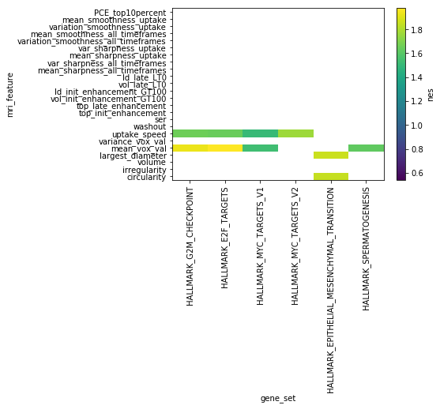

## Setup ## {.collapsed}

Load libraries.

```python
import sys

from IPython.display import display, Markdown
import numpy as np
import pandas as pd
from tabulate import tabulate
import xarray as xr

sys.path.append('../src/lib/')
import plot
```


```python
import matplotlib
matplotlib.rcParams['font.family'] = 'sans-serif'
matplotlib.rcParams['font.sans-serif'] = ['Alegreya Sans']
```


A utility function to display tables.

```python
def display_table(t):
    display(Markdown(
        '<div class="datatable">' +
        tabulate(t, headers='keys') +
        "\n\n</div>"
    ))
```


Load gene set enrichment analysis (GSEA) results on the MsigDB Hallmarks set.


```python
ds = xr.open_dataset("../analyses/gsea/h.all_T.nc")
ds['mri_feature'] = [s.decode() for s in ds['mri_feature'].values]
ds['gene_set'] = [s.decode() for s in ds['gene_set'].values]
display(ds)
```

```
<xarray.Dataset>
Dimensions:      (gene_set: 50, mri_feature: 24)
Coordinates:
  * mri_feature  (mri_feature) <U35 'circularity' 'irregularity'
'volume' ...
  * gene_set     (gene_set) <U42 'HALLMARK_TNFA_SIGNALING_VIA_NFKB'
...
Data variables:
    es           (mri_feature, gene_set) float64 0.2909 0.3832 0.3324
0.3498 ...
    p            (mri_feature, gene_set) float64 0.6669 0.1087 0.539
0.2783 ...
    nes          (mri_feature, gene_set) float64 0.9025 1.175 0.9792
1.086 ...
    fdr          (mri_feature, gene_set) float64 0.8975 0.4787 0.818
0.6597 ...
    fwer         (mri_feature, gene_set) float64 1.0 1.0 1.0 1.0 1.0
1.0 1.0 ...
    max_es_at    (mri_feature, gene_set) float64 4.663e+03 4.217e+03
...
    le_prop      (mri_feature, gene_set) float64 0.4167 0.497 0.6154
0.4115 ...
```


## Results ##


```python
plot_ds = ds.copy()
plot_ds['significance_mask'] = ds['fdr'] > 0.25
plot_ds = plot_ds.sel(
    gene_set=np.logical_not(plot_ds['significance_mask'])
             .sum('mri_feature') > 0,
)
with plot.subplots(1, 1) as (fig, ax):
    plot.heatmap(plot_ds['nes'], mask=plot_ds['significance_mask'], ax=ax)
    ax.set_xticklabels(ax.get_xticklabels(), rotation=90)
```

```
/home/tycho/Projects/Imagene/mri-rnaseq-
integration/venv/lib/python3.6/site-
packages/matplotlib/font_manager.py:1297: UserWarning: findfont: Font
family ['sans-serif'] not found. Falling back to DejaVu Sans
  (prop.get_family(), self.defaultFamily[fontext]))
```

{#es-heatmap }\


```python
df = ds.to_dataframe()
df.reset_index(level=0, inplace=True)
display_table(df.loc[df['fdr'] < 0.25])
```


<div class="datatable">mri_feature       gene_set                                          es           p      nes        fdr      fwer    max_es_at    le_prop
----------------  ------------------------------------------  --------  ----------  -------  ---------  --------  -----------  ---------
mean_vox_val      HALLMARK_G2M_CHECKPOINT                     0.62517   0.00369963  1.93383  0.0315265  0.184982         2280   0.583333
uptake_speed      HALLMARK_G2M_CHECKPOINT                     0.540112  0.0323      1.65809  0.117596   1                3215   0.583333
mean_vox_val      HALLMARK_E2F_TARGETS                        0.634263  0.0048      1.97713  0.0315265  0.24             2300   0.622222
uptake_speed      HALLMARK_E2F_TARGETS                        0.533426  0.0481952   1.64931  0.117596   1                3912   0.655556
mean_vox_val      HALLMARK_MYC_TARGETS_V1                     0.477742  0.0183982   1.53602  0.167466   0.919908         3434   0.533679
uptake_speed      HALLMARK_MYC_TARGETS_V1                     0.470222  0.0236976   1.50738  0.202166   1                3381   0.492228
uptake_speed      HALLMARK_MYC_TARGETS_V2                     0.602285  0.00770925  1.76869  0.117596   0.385463         2878   0.618182
circularity       HALLMARK_EPITHELIAL_MESENCHYMAL_TRANSITION  0.584357  0.0182982   1.85022  0.103377   0.914909         2313   0.52809
largest_diameter  HALLMARK_EPITHELIAL_MESENCHYMAL_TRANSITION  0.58873   0.0176982   1.8619   0.0983901  0.884912         2899   0.623596
mean_vox_val      HALLMARK_SPERMATOGENESIS                    0.572799  0.0018      1.62621  0.133079   0.09             2490   0.491228

</div>
