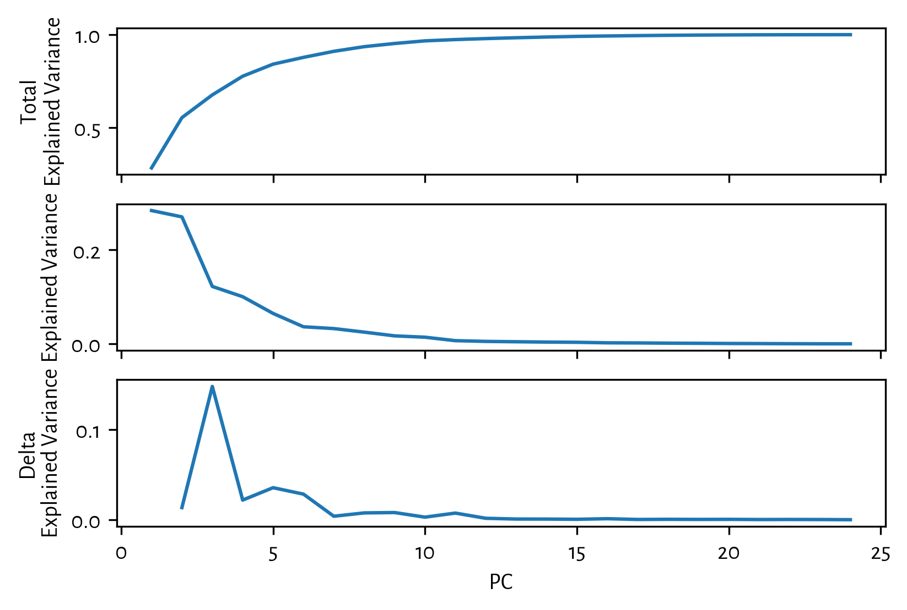
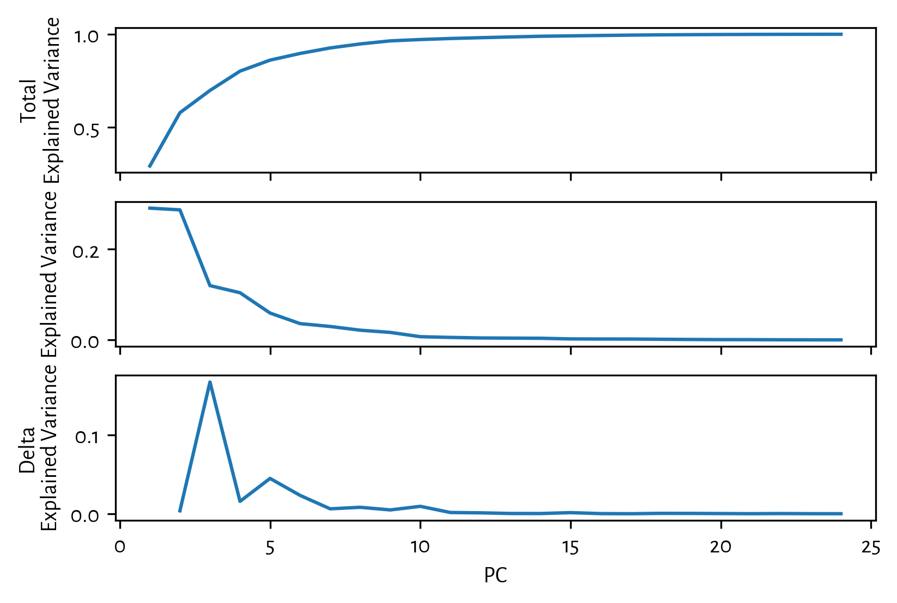
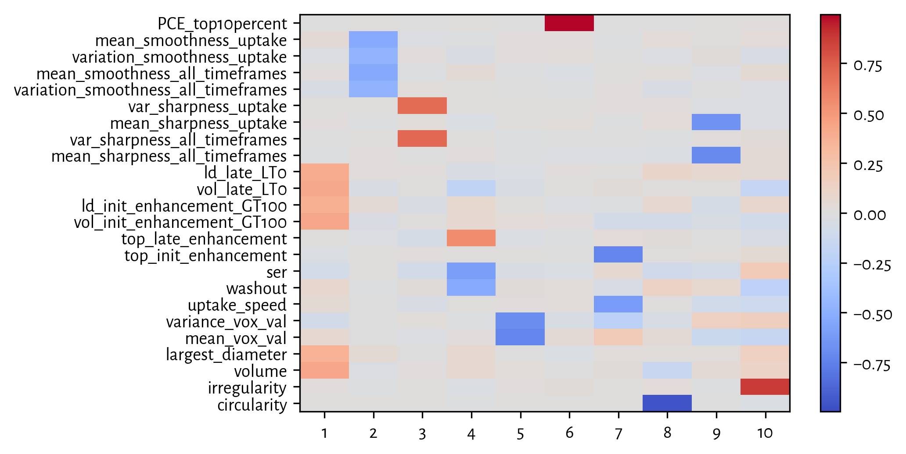
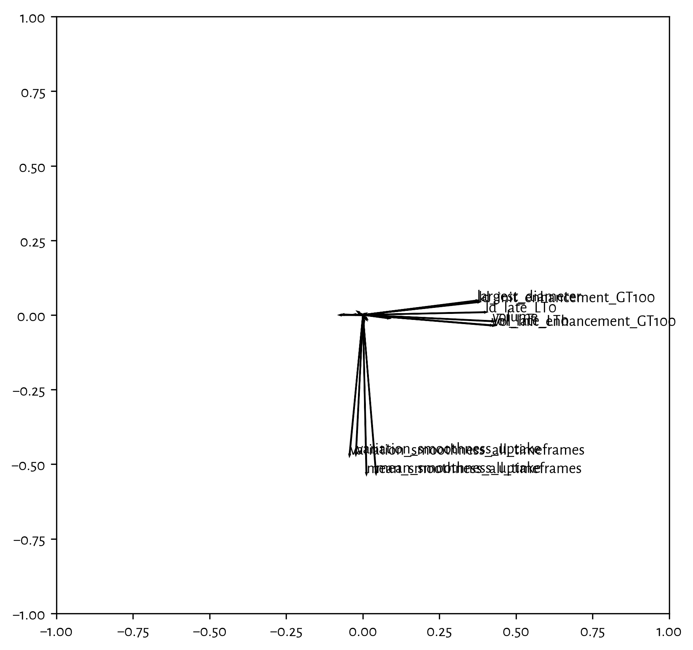

## Setup ## {.collapsed}

Load libraries.


```python
from math import sqrt, ceil

import factor_rotation
from IPython.display import display, Markdown
import numpy as np
import scipy.stats
import sklearn.decomposition
import xarray as xr

import plot
```


Setup style of plots.


```python
import matplotlib
matplotlib.rcParams['font.family'] = 'sans-serif'
matplotlib.rcParams['font.sans-serif'] = ['Alegreya Sans']
matplotlib.rcParams['font.weight'] = 'regular'
matplotlib.rcParams['figure.dpi'] = 300
```


```python
mri_ds = xr.open_dataset('../data/processed/mri-features.nc')
del mri_ds['Comment']
del mri_ds['MultiFocal']
mri = mri_ds.to_array('cad_feature', 'mri_cad_features')
mri_ds.close()
mri = mri.isel(case=np.where(mri.isnull().sum('cad_feature') == 0)[0])
mri = mri.transpose('case', 'cad_feature')
print(mri)
```

```
<xarray.DataArray 'mri_cad_features' (case: 282, cad_feature: 24)>
array([[  8.343770e-01,   4.046130e-01,   7.845880e+02, ...,
3.197430e+00,
          5.604590e-01,   3.728000e-01],
       [  7.080830e-01,   5.653050e-01,   1.351080e+04, ...,
1.607050e+00,
          5.389980e-01,   2.770000e-01],
       [  8.127700e-01,   5.227460e-01,   5.224870e+03, ...,
3.299920e+00,
          5.780610e-01,   4.661000e-01],
       ...,
       [  8.156050e-01,   4.480070e-01,   4.401050e+03, ...,
3.501010e+00,
          5.770520e-01,   2.941000e-01],
       [  7.208790e-01,   6.401100e-01,   1.725120e+04, ...,
3.899760e+00,
          5.887040e-01,   5.646000e-01],
       [  6.442930e-01,   4.969370e-01,   1.826620e+03, ...,
1.412870e+00,
          5.200650e-01,   5.387000e-01]])
Coordinates:
  * case         (case) int64 192 196 199 207 208 217 219 269 273 274
288 ...
  * cad_feature  (cad_feature) <U35 'circularity' 'irregularity'
'volume' ...
Attributes:
    title:    MRI features from Margins of samples with gene
expression data ...
    history:  2017-04-12T14:56:13+00:00 process_mri.py Converted from
/home/t...
```


## Only linear scale adjustment ##

### PCA ###


```python
pca = sklearn.decomposition.PCA()
pca.fit((mri / mri.std('case')).values)
```

```
PCA(copy=True, iterated_power='auto', n_components=None,
random_state=None,
  svd_solver='auto', tol=0.0, whiten=False)
```


```python
total_var = np.sum(pca.explained_variance_)
with plot.subplots(3, 1, sharex=True) as (fig, axs):
    axs[0].plot(
        range(1, len(pca.explained_variance_)+1),
        np.cumsum(pca.explained_variance_) / total_var
    )
    axs[0].set_ylabel("Total\nExplained Variance")
    axs[1].plot(
        range(1, len(pca.explained_variance_)+1),
        pca.explained_variance_ / total_var
    )
    axs[1].set_ylabel("Explained Variance")
    axs[2].plot(
        range(2, len(pca.explained_variance_)+1),
        abs(pca.explained_variance_[1:] - pca.explained_variance_[:-1]) /
        total_var,
    )
    axs[2].set_xlabel("PC")
    axs[2].set_ylabel("Delta\nExplained Variance")
n_components = 11
```

{#pca-ev }\


```python
plot.heatmap(
    pca.components_[:n_components, :].T,
    xticklabels=[str(i+1) for i in range(n_components)],
    yticklabels=mri.cad_feature.values,
)
```

{#heatmap-pca }\


```python
with plot.subplots(1, 1, figsize=(7, 7)) as (fig, ax):
    ax.set_xlim(-1, 1)
    ax.set_ylim(-1, 1)
    for i in range(pca.components_.shape[1]):
        ax.arrow(0, 0, pca.components_[0, i], pca.components_[1, i])
        alength = sqrt(pca.components_[0, i]**2 + pca.components_[1, i]**2)
        if alength > 0.25:
            ax.text(pca.components_[0, i], pca.components_[1, i],
                    mri['cad_feature'].values[i])
```

{#plot-pca-a }\


### Normal QQ-plots of MRI CAD features ###


```python
nf = len(mri['cad_feature'])
nc = len(mri['case'])
n_row = ceil(nf / 3)
n_col = 3
fs = (n_col*3, n_row*3)
with plot.subplots(n_row, n_col, figsize=fs) as (fig, axs):
    norm = scipy.stats.norm(0, 1)
    q_norm = norm.ppf(np.linspace(1 / nc, 1 - (1 / nc), nc))
    for i in range(nf):
        row, col = divmod(i, n_col)
        q_feature = mri.isel(cad_feature=i).values
        plot.qqplot(
            q_norm, q_feature,
            ax=axs[row, col],
            xlabel='Normal Q',
            ylabel=str(mri['cad_feature'].values[i]) + " Q",
            title=""
        )
    fig.tight_layout()
```

{#qqplot-mri-features }\


## Adjusted Scale ##


```python
mri_adj = xr.DataArray(np.full(mri.shape, np.nan), mri.coords, mri.dims)
for feature in mri['cad_feature'].values:
    if feature[0:3] == 'vol':
        mri_adj.loc[:, feature] = np.cbrt(mri.loc[:, feature])
    elif feature[0:3] == 'var':
        mri_adj.loc[:, feature] = np.sqrt(mri.loc[:, feature])
    else:
        mri_adj.loc[:, feature] = mri.loc[:, feature]
mri_adj
mri_adj.to_netcdf('t.nc')
```


### Normal QQ-plots of MRI CAD features ###


```python
nf = len(mri_adj['cad_feature'])
nc = len(mri_adj['case'])
n_row = ceil(nf / 3)
n_col = 3
fs = (n_col*3, n_row*3)
with plot.subplots(n_row, n_col, figsize=fs) as (fig, axs):
    norm = scipy.stats.norm(0, 1)
    q_norm = norm.ppf(np.linspace(1 / nc, 1 - (1 / nc), nc))
    for i in range(nf):
        row, col = divmod(i, n_col)
        q_feature = mri_adj.isel(cad_feature=i).values
        plot.qqplot(
            q_norm, q_feature,
            ax=axs[row, col],
            xlabel='Normal Q',
            ylabel=str(mri_adj['cad_feature'].values[i]) + " Q",
            title=""
        )
    fig.tight_layout()
```

{#qqplot-mri-features-adj }\


### PCA ###


```python
pca_adj = sklearn.decomposition.PCA()
pca_adj.fit((mri_adj / mri_adj.std('case')).values)
```

```
PCA(copy=True, iterated_power='auto', n_components=None,
random_state=None,
  svd_solver='auto', tol=0.0, whiten=False)
```


```python
total_var = np.sum(pca.explained_variance_)
with plot.subplots(3, 1, sharex=True) as (fig, axs):
    axs[0].plot(
        range(1, len(pca_adj.explained_variance_)+1),
        np.cumsum(pca_adj.explained_variance_) / total_var
    )
    axs[0].set_ylabel("Total\nExplained Variance")
    axs[1].plot(
        range(1, len(pca_adj.explained_variance_)+1),
        pca_adj.explained_variance_ / total_var
    )
    axs[1].set_ylabel("Explained Variance")
    axs[2].plot(
        range(2, len(pca_adj.explained_variance_)+1),
        abs(pca_adj.explained_variance_[1:] -
            pca_adj.explained_variance_[:-1]) /
        total_var,
    )
    axs[2].set_xlabel("PC")
    axs[2].set_ylabel("Delta\nExplained Variance")
n_components = 10
```

{#pca-adj-ev }\


```python
plot.heatmap(
    pca_adj.components_[:n_components, :].T,
    xticklabels=[str(i+1) for i in range(n_components)],
    yticklabels=mri_adj.cad_feature.values,
)
```

{#heatmap-pca-adj }\


```python
with plot.subplots(1, 1, figsize=(7, 7)) as (fig, ax):
    ax.set_xlim(-1, 1)
    ax.set_ylim(-1, 1)
    for i in range(pca_adj.components_.shape[1]):
        ax.arrow(0, 0, pca_adj.components_[0, i], pca_adj.components_[1, i])
        alength = sqrt(pca_adj.components_[0, i]**2 +
                       pca_adj.components_[1, i]**2)
        if alength > 0.25:
            ax.text(pca_adj.components_[0, i], pca_adj.components_[1, i],
                    mri_adj['cad_feature'].values[i])
```

{#plot-pca-adj-a }\


#### Varimax ####


```python
coeff_varimax, _ = factor_rotation.rotate_factors(
    pca_adj.components_[:n_components, :].T,
    'varimax',
)
coeff_varimax = coeff_varimax.T
```


```python
plot.heatmap(
    coeff_varimax.T,
    xticklabels=[str(i+1) for i in range(coeff_varimax.shape[0])],
    yticklabels=mri_adj.cad_feature.values,
)
```

{#heatmap-pca-adj-varimax }\


```python
with plot.subplots(1, 1, figsize=(7, 7)) as (fig, ax):
    ax.set_xlim(-1, 1)
    ax.set_ylim(-1, 1)
    for i in range(coeff_varimax.shape[1]):
        ax.arrow(0, 0, coeff_varimax[0, i], coeff_varimax[1, i])
        alength = sqrt(coeff_varimax[0, i]**2 +
                       coeff_varimax[1, i]**2)
        if alength > 0.25:
            ax.text(coeff_varimax[0, i], coeff_varimax[1, i],
                    mri_adj['cad_feature'].values[i])
```

{#plot-pca-adj-varimax }\

